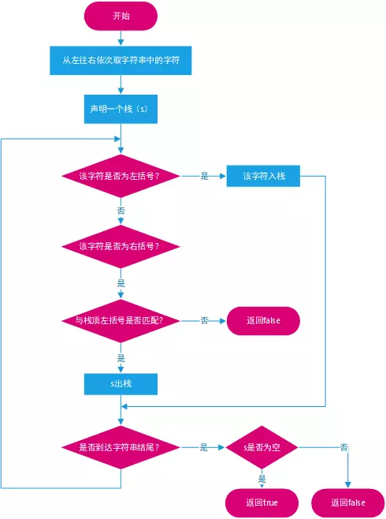
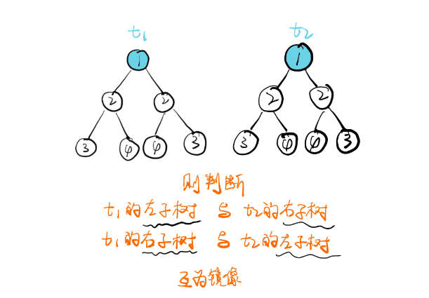
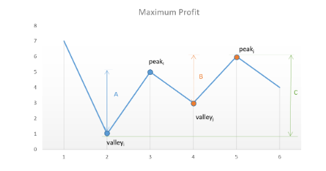
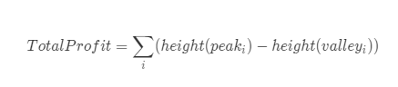
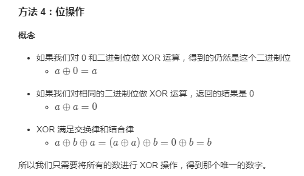
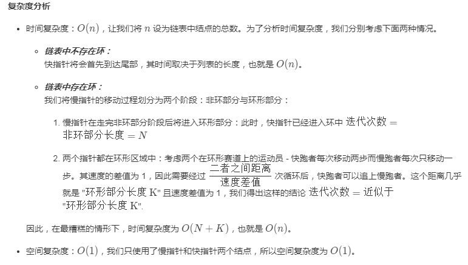
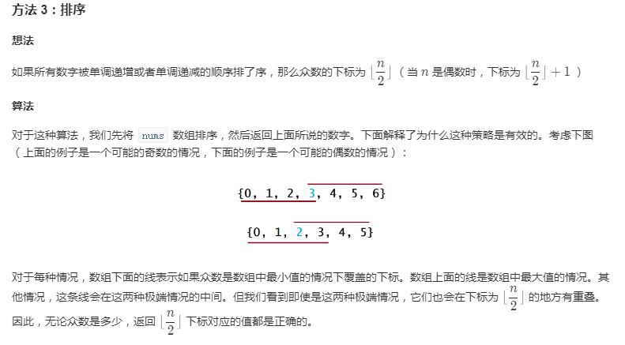
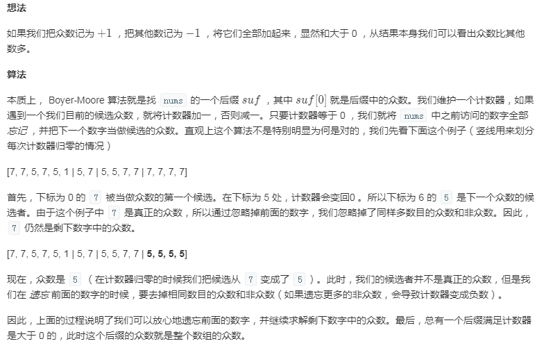

# 《leetcode刷题笔记》——书瓖果


## 8.字符串转整数

### 题目描述

> 请你来实现一个 atoi 函数，使其能将字符串转换成整数。
>
> 首先，该函数会根据需要丢弃无用的开头空格字符，直到寻找到第一个非空格的字符为止。
>
> 当我们寻找到的第一个非空字符为正或者负号时，则将该符号与之后面尽可能多的连续数字组合起来，作为该整数的正负号；假如第一个非空字符是数字，则直接将其与之后连续的数字字符组合起来，形成整数。
>
> 该字符串除了有效的整数部分之后也可能会存在多余的字符，这些字符可以被忽略，它们对于函数不应该造成影响。
>
> 注意：假如该字符串中的第一个非空格字符不是一个有效整数字符、字符串为空或字符串仅包含空白字符时，则你的函数不需要进行转换。
>
> 在任何情况下，若函数不能进行有效的转换时，请返回 0。
>
> 说明：
>
> 假设我们的环境只能存储 32 位大小的有符号整数，那么其数值范围为 [−231,  231 − 1]。如果数值超过这个范围，请返回  INT_MAX (231 − 1) 或 INT_MIN (−231) 。
>
> 示例 1:
>
> 输入: "42"
> 输出: 42
> 示例 2:
>
> 输入: "   -42"
> 输出: -42
> 解释: 第一个非空白字符为 '-', 它是一个负号。
>      我们尽可能将负号与后面所有连续出现的数字组合起来，最后得到 -42 。
> 示例 3:
>
> 输入: "4193 with words"
> 输出: 4193
> 解释: 转换截止于数字 '3' ，因为它的下一个字符不为数字。
> 示例 4:
>
> 输入: "words and 987"
> 输出: 0
> 解释: 第一个非空字符是 'w', 但它不是数字或正、负号。
>      因此无法执行有效的转换。
> 示例 5:
>
> 输入: "-91283472332"
> 输出: -2147483648
> 解释: 数字 "-91283472332" 超过 32 位有符号整数范围。 
>      因此返回 INT_MIN (−231) 。
>
> 

### 解题思路

> 注意判断各种情况，然后最值判断通过一个标志位，避免分正负情况

### 代码实现

```c++
int myAtoi(string str) {
	if(isalpha(str[0])) return 0;
	long long  ans=0;
	int flag=0;// 出现 '-' 置1 
	int len=0;//记录数字的长度   
	int temp=0;//记录 "+-" 出现的次数 
	for (char c:str) {
		//判断 正负号   且数字长度为0  防止 "0-1" 这样的情况 
		if((c=='+' || c=='-') &&len==0) {
			temp++;			//记录符号出现次数 
			flag=(c=='-')? 1:0;
		}
		else if( 0<=(c-'0') && (c-'0')<=9 && temp<2) { 		//temp<2 表示 正负号 只出现过一次 
			ans=ans*10+(c-'0');
			len++;
			// INT_MAX=2147483647 	INT_MIN=-2147483648   
			if(ans-1>INT_MAX) break;		// 如果 数字的绝对值 大于 INT_MAX +1 那么直接跳出 一定溢出 
		} else if(c==' ' && len==0 && temp==0 	)		//如果是空格则继续 但前提是 之前没有出现过 正负号 和 数字 
			continue;
		else		//其他情况：英文和其他字符 
			break;
	}
	if (flag==1)			//flag==1 表示数字为负 
		return -ans<INT_MIN? INT_MIN:-ans;
	return ans>INT_MAX? INT_MAX:ans;
}
链接：https://leetcode-cn.com/problems/string-to-integer-atoi/solution/zhi-xing-yong-shi-0-ms-zai-suo-you-c-ti-jiao-zho-3/
```


## 9. 判断一个数是否是回文数

### 题目描述

>  *判断一个整数是否是回文数。回文数是指正序（从左向右）和倒序（从右向左）读都是一样的整数。*

### 解题思路

> 对于数字的末位，直接取余就可以了，对于数字的首位，我们可以这么算。
> 首先用一个变量记录数字的最高位
> 比如12321，可以标记为help为10000
> 第一个末位为1，第一个首位为12321/10000=1
> 接下来我们需要计算232是否为回文。怎么计算呢。
> 我们需要去掉首位和末位。
> 可以采用x % help / 10的方式
> 12321%10000==2321可以将最高位去掉，然后2321/10==232可以将最低为去掉。
> 最后不要忘记将help/100

### 代码实现-1:基于数学的方法

```cpp
public bool isPalindrome(int x) {
    if (x <0) return false;
    int help = 1;
    int tmp = x;
    while (tmp >= 10) {
        help *= 10;
        tmp /= 10;
    }
    
    while (x != 0) {
        if (x % 10 != x / help) {
            return false;
        }
        x = x % help / 10;
        help /= 100;
    }
    return true;
}
参考链接：https://leetcode-cn.com/problems/palindrome-number/solution/ji-bai-liao-99de-javayong-hu-dai-ma-you-ya-by-reed/
```


### 代码实现-2：将数字转换成字符串

```C++
#include<string> //string
#include<algorithm> //reverse
#include<sstream> //stringstream
using namespace std;
class Solution {
public:
    bool isPalindrome(int x) {
        if (x < 0) return false;
        string str_x = to_string(x);
        std::reverse(str_x.begin(), str_x.end());
        long rev;

        stringstream out(str_x);
        out >> rev;// 结果写入rev
        return x == rev;
    }
};
参考链接：https://leetcode-cn.com/problems/palindrome-number/solution/hui-wen-shu-by-gpe3dbjds1/
```


## 13.罗马数字转整数

### 题目描述

> 罗马数字包含以下七种字符: I， V， X， L，C，D 和 M。
>
> 字符          数值
> I             1
> V             5
> X             10
> L             50
> C             100
> D             500
> M             1000
> 例如， 罗马数字 2 写做 II ，即为两个并列的 1。12 写做 XII ，即为 X + II 。 27 写做  XXVII, 即为 XX + V + II 。
>
> 通常情况下，罗马数字中小的数字在大的数字的右边。但也存在特例，例如 4 不写做 IIII，而是 IV。数字 1 在数字 5 的左边，所表示的数等于大数 5 减小数 1 得到的数值 4 。同样地，数字 9 表示为 IX。这个特殊的规则只适用于以下六种情况：
>
> I 可以放在 V (5) 和 X (10) 的左边，来表示 4 和 9。
> X 可以放在 L (50) 和 C (100) 的左边，来表示 40 和 90。 
> C 可以放在 D (500) 和 M (1000) 的左边，来表示 400 和 900。
> 给定一个罗马数字，将其转换成整数。输入确保在 1 到 3999 的范围内。
>
> 示例 1:
>
> 输入: "III"
> 输出: 3
> 示例 2:
>
> 输入: "IV"
> 输出: 4
> 示例 3:
>
> 输入: "IX"
> 输出: 9
> 示例 4:
>
> 输入: "LVIII"
> 输出: 58
> 解释: L = 50, V= 5, III = 3.
> 示例 5:
>
> 输入: "MCMXCIV"
> 输出: 1994
> 解释: M = 1000, CM = 900, XC = 90, IV = 4.


### 解题思路

> 构建一个字典记录所有罗马数字子串，注意长度为2的子串记录的值是（实际值 - 子串内左边罗马数字代表的数值）
>
> 这样一来，遍历整个 s 的时候判断当前位置和前一个位置的两个字符组成的字符串是否在字典内，如果在就记录值，不在就说明当前位置不存在小数字在前面的情况，直接记录当前位置字符对应值
>
> 举个例子，遍历经过 IV 的时候先记录 II 的对应值 11 再往前移动一步记录 IV 的值 3，加起来正好是 IV 的真实值 4。max 函数在这里是为了防止遍历第一个字符的时候出现[−1:0] 的情况
>
> 

### 代码实现

```cpp
#include<string>
#include<unordered_map>
using namespace std;
class Solution {
public:
    int romanToInt(string s) {
         unordered_map<string, int> m = {{"I", 1}, {"IV", 3}, {"IX", 8}, {"V", 5}, {"X", 10}, {"XL", 30}, {"XC", 80}, {"L", 50}, {"C", 100}, {"CD", 300}, {"CM", 800}, {"D", 500}, {"M", 1000}};
         int r = m[s.substr(0,1)];
         for (int i = 1; i < s.size(); i++) {
             string two = s.substr(i-1, 2);
             string one = s.substr(i, 1);         

             r += m[two] ? m[two] : m[one];
        }
        return r;
    }
};
参考链接：https://leetcode-cn.com/problems/roman-to-integer/solution/2-xing-python-on-by-knifezhu/
```

## 14.最长公共前缀

### 题目描述

> 编写一个函数来查找字符串数组中的最长公共前缀。
>
> 如果不存在公共前缀，返回空字符串 ""。
>
> 示例 1:
>
> 输入: ["flower","flow","flight"]
> 输出: "fl"
> 示例 2:
>
> 输入: ["dog","racecar","car"]
> 输出: ""
> 解释: 输入不存在公共前缀。


### 解题思路

> 找到最短字符串，以它的长度为基准，从所有字符串的第一个字符开始对比，若都一样，ans加上该字符，若不一样，返回答案


### 代码实现

```cpp
#include<iostream>
#include<vector>
#include<string>

using namespace std;

class Solution {
public:
    string longestCommonPrefix(vector<string>& strs) {
        string ans = "";
        if (strs.empty()) return ans;
        if (strs.size() == 1) return strs.at(0);

        // 找最短的字符串
        string min = strs.at(0);
        for (int i = 1; i < strs.size(); i++) {
            if (strs.at(i).size() < min.size()) {
                min = strs.at(i);
            }
        }

        // 从第一个字符开始对比，直到找到不一样的
        for (int i = 0; i < min.size(); i++) {
            for (int j = 0; j < strs.size(); j++) {
                if (min.at(i) != strs.at(j).at(i)) {
                    return ans;
                }
            }
            ans += min.at(i);
        }
        return ans;
    }
};
参考链接：https://leetcode-cn.com/problems/longest-common-prefix/solution/cxiang-xi-ti-jie-by-youlookdeliciousc-5/
```

## 130. 被围绕的区域

### 题目描述

> 给定一个二维的矩阵，包含 'X' 和 'O'（字母 O）。
> 找到所有被 'X' 围绕的区域，并将这些区域里所有的 'O' 用 'X' 填充。
> 示例:
> X X X X
> X O O X
> X X O X
> X O X X
> 运行你的函数后，矩阵变为：
> X X X X
> X X X X
> X X X X
> X O X X
>
> 解释:
> 被围绕的区间不会存在于边界上，换句话说，任何边界上的 'O' 都不会被填充为 'X'。 任何不在边界上，或不与边界上的 'O' 相连的 'O' 最终都会被填充为 'X'。如果两个元素在水平或垂直方向相邻，则称它们是“相连”的。

### 解题思路

> 该题目需要将所有被X包围的O找出来，那剩下的O就是连接起来与边界连通的O。直接找出来所有被X包围的O并不好找，但是我们可以用排除法：先找到所有连接起来与边界连通的O，将这些O标记一下，然后遍历数组，所有没有被标记的O就是我们要找的O。
>
> 首先对矩阵边界上所有的O做深度优先搜索，将相连的O更改为-，然后编辑数组，将数组中O更改为X，将数组中-更改为O。

### 代码实现

```java
class Solution {
    int row,col;
    public void solve(char[][] board) {
        if(board==null||board.length==0)
            return ;
        row=board.length;
        col=board[0].length;
        for(int i=0;i<row;i++){    //对第一行和最后一行的所有O进行深度优先搜索
                dfs(board,i,0);
                dfs(board,i,col-1);
        }
        for(int j=0;j<col;j++){    //对第一列和最后一列的所有O进行深度优先搜索
                dfs(board,0,j);
                dfs(board,row-1,j);
        }
        for(int i=0;i<row;i++){    //遍历矩阵，将O变为X，将-变为O
            for(int j=0;j<col;j++){
                if(board[i][j]=='O')
                    board[i][j]='X';
                if(board[i][j]=='-')
                    board[i][j]='O';
            }
        }
        return ;
    }
  /**
  * 使用递归进行深度优先搜索
  */
    public void dfs(char[][] board,int i,int j){
        if(i<0||j<0||i>=row||j>=col||board[i][j]!='O')   //递归终止条件判断
            return;
        board[i][j]='-';    //将当前O更改为-
            dfs(board,i-1,j);   //递归该点上方的点
            dfs(board,i+1,j);   //递归该点下方的点
            dfs(board,i,j-1);   //递归该点左边的点
            dfs(board,i,j+1);   //递归该点右边的点
        return ;
    }
}
参考链接：https://www.jianshu.com/p/51a845dabaea
```


## 单链表反转算法

### 题目描述

> 讲一个单链表进行反转


### 解题思路

> 创建3个指针，分别指向上一个节点、当前节点、下一个节点，遍历整个链表的同时，将正在访问的节点指向上一个节点，当遍历结束后，就同时完成了链表的反转。


### 代码实现

```cpp
ListNode* ReverseList(ListNode* pHead) {
    ListNode *p, *q, *r;
    if (pHead == nullptr || pHead->next	 == nullptr) return pHead;
    else {
        p = pHead;
        q = p->next;
        pHead->next = nullptr;
        while (q->next != nullptr) {
            r = p->next;
            q->next = p;
            p = q;
            q = r;
        }
    }
}
```


## 20. 括号匹配问题

### 题目描述

> 给定一个只包括 '('，')'，'{'，'}'，'['，']' 的字符串，判断字符串是否有效。
>
> 有效字符串需满足：
>
> 左括号必须用相同类型的右括号闭合。
> 左括号必须以正确的顺序闭合。
> 注意空字符串可被认为是有效字符串。
>
> 示例 1:
>
> 输入: "()"
> 输出: true
> 示例 2:
>
> 输入: "()[]{}"
> 输出: true
> 示例 3:
>
> 输入: "(]"
> 输出: false
> 示例 4:
>
> 输入: "([)]"
> 输出: false
> 示例 5:
>
> 输入: "{[]}"
> 输出: true

### 解题思路



> C++中自带栈数据结构，需要包含头文件<stack>。使用**string**类型的变量**bracketLeft**和**bracketRight**来存储左括号和右括号，判断右括号与左括号匹配的方法是：先在**bracketRight**找到该字符的索引，然后对比栈顶字符和**bracketLeft**相同索引处的字符是否匹配。

### 代码实现

```cpp
#include<stack>
#include<string>
using namespace std;
class Solution {
public:
    bool isValid(string s) {
        if (s.empty()) return true;
        string bracketLeft = "{[(";
        string bracketRight = "}])";
        stack<char> sta;
        for (int i = 0; i < s.size(); i++) {
            char ch = s.at(i);
            int indexLeft = -1, indexRight = -2;
            indexLeft = bracketLeft.find(ch);
            indexRight = bracketRight.find(ch);

            // 是左括号
            if (indexLeft >= 0) {
                sta.push(ch);
            } else if (indexRight >= 0) {
                // 匹配成功
                if (!sta.empty() && sta.top() == bracketLeft[indexRight]) {
                    sta.pop();
                } else {
                    return false;
                }
            }
        }
        return sta.empty();
    }
};
```

## 21.合并两个有序链表

### 题目描述

> 将两个有序链表合并为一个新的有序链表并返回。新链表是通过拼接给定的两个链表的所有节点组成的。 
>
> 示例：
>
> 输入：1->2->4, 1->3->4
> 输出：1->1->2->3->4->4
>
> 来源：力扣（LeetCode）
> 链接：https://leetcode-cn.com/problems/merge-two-sorted-lists

### 解题思路

> 迭代法：首先，我们设定一个哨兵节点 "prehead" ，这可以在最后让我们比较容易地返回合并后的链表。我们维护一个 prev 指针，我们需要做的是调整它的 next 指针。然后，我们重复以下过程，直到 l1 或者 l2 指向了 null ：如果 l1 当前位置的值小于等于 l2 ，我们就把 l1 的值接在 prev 节点的后面同时将 l1 指针往后移一个。否则，我们对 l2 做同样的操作。不管我们将哪一个元素接在了后面，我们都把 prev 向后移一个元素。
>
> 在循环终止的时候， l1 和 l2 至多有一个是非空的。由于输入的两个链表都是有序的，所以不管哪个链表是非空的，它包含的所有元素都比前面已经合并链表中的所有元素都要大。这意味着我们只需要简单地将非空链表接在合并链表的后面，并返回合并链表。
> 链接：https://leetcode-cn.com/problems/merge-two-sorted-lists/solution/he-bing-liang-ge-you-xu-lian-biao-by-leetcode/
>

### 代码实现

```cpp
struct ListNode {
    int val;
    ListNode *next;
    ListNode(int x): val(x), next(nullptr) {}
}
class Solution {
public:
    ListNode* mergeTwoLists(ListNode* l1, ListNode* l2) {
        ListNode* prehead = new ListNode(-1);
        ListNode* prev = prehead;
        while(l1 != nullptr && l2 != nullptr) {
            if(l1->val <= l2->val) {
                prev->next = l1;
                l1 = l1->next;
            } else {
                prev->next = l2;
                l2 = l2->next;
            }
            prev = prev->next;
        }
        prev->next = （l1 != nullptr) ? l1 : l2;

        return prehead->next;
    }
};

链接：https://leetcode-cn.com/problems/merge-two-sorted-lists/solution/he-bing-liang-ge-you-xu-lian-biao-guan-fang-cban-b/

```

## 26. 删除排序数组中的重复项

### 题目描述

> 给定一个排序数组，你需要在原地删除重复出现的元素，使得每个元素只出现一次，返回移除后数组的新长度。
>
> 不要使用额外的数组空间，你必须在原地修改输入数组并在使用 O(1) 额外空间的条件下完成。
>
> 示例 1:
>
> 给定数组 nums = [1,1,2], 
>
> 函数应该返回新的长度 2, 并且原数组 nums 的前两个元素被修改为 1, 2。 
>
> 你不需要考虑数组中超出新长度后面的元素。
> 示例 2:
>
> 给定 nums = [0,0,1,1,1,2,2,3,3,4],
>
> 函数应该返回新的长度 5, 并且原数组 nums 的前五个元素被修改为 0, 1, 2, 3, 4。
>
> 你不需要考虑数组中超出新长度后面的元素。
> 说明:
>
> 为什么返回数值是整数，但输出的答案是数组呢?
>
> 请注意，输入数组是以“引用”方式传递的，这意味着在函数里修改输入数组对于调用者是可见的。
>
> 你可以想象内部操作如下:
>
> // nums 是以“引用”方式传递的。也就是说，不对实参做任何拷贝
> int len = removeDuplicates(nums);
>
> // 在函数里修改输入数组对于调用者是可见的。
> // 根据你的函数返回的长度, 它会打印出数组中该长度范围内的所有元素。
> for (int i = 0; i < len; i++) {
>     print(nums[i]);
> }
> 链接：https://leetcode-cn.com/problems/remove-duplicates-from-sorted-array

### 解题思路

> 双指针法:数组完成排序后，我们可以放置两个指针 i 和 j，其中 i是慢指针，而 j是快指针。只要 nums[i] == nums[j]，我们就增加 j 以跳过重复项。
>
> 当我们遇到 nums[j] ！=nums[i] 时，跳过重复项的运行已经结束，因此我们必须把nums[j]的值复制到 nums[i + 1]。然后递增 i，接着我们将再次重复相同的过程，直到 j 到达数组的末尾为止。
> 链接：https://leetcode-cn.com/problems/remove-duplicates-from-sorted-array/solution/shan-chu-pai-xu-shu-zu-zhong-de-zhong-fu-xiang-by-/
>

### 复杂度分析

- 时间复杂度：O(n)，假设数组的长度是 n**，那么 i和 j** 分别最多遍历 n 步。
- 空间复杂度：O(1)。

### 代码实现

``` cpp
#include<vector>
using namespace std;
class Solution {
public:
    int removeDuplicates(vector<int>& nums) {
        if (nums.size() == 0) return 0;
        int i = 0;
        for (int j = 1; j < nums.size(); j++) {
            if (nums[i] != nums[j]) {
                i++;
                nums[i] = nums[j];
            }
        }
        return i+1;
    }
};
```


## 27.移除元素

### 题目描述

> 给定一个数组 *nums* 和一个值 *val*，你需要**原地**移除所有数值等于 *val* 的元素，返回移除后数组的新长度。
>
> 不要使用额外的数组空间，你必须在**原地修改输入数组**并在使用 O(1) 额外空间的条件下完成。
>
> 元素的顺序可以改变。你不需要考虑数组中超出新长度后面的元素。
>
> **示例 1:**
>
> ```
> 给定 nums = [3,2,2,3], val = 3,
> 
> 函数应该返回新的长度 2, 并且 nums 中的前两个元素均为 2。
> 
> 你不需要考虑数组中超出新长度后面的元素。
> ```
>
> **示例 2:**
>
> ```
> 给定 nums = [0,1,2,2,3,0,4,2], val = 2,
> 
> 函数应该返回新的长度 5, 并且 nums 中的前五个元素为 0, 1, 3, 0, 4。
> 
> 注意这五个元素可为任意顺序。
> 
> 你不需要考虑数组中超出新长度后面的元素。
> ```


### 解题思路

> 类似26题，双指针法,注意i值

### 代码实现

```cpp
#include<vector>
using namespace std;

class Solution {
public:
    int removeElement(vector<int>& nums, int val) {
        if (nums.size() == 0) return 0;
        int i = 0;
        for (int  j = 0; j < nums.size(); j++) {
            if (nums[j] != val) {
                nums[i++] = nums[j];
            }
        }
        return i;
    }
};
```


## 35.搜索插入位置

### 题目描述

> 给定一个排序数组和一个目标值，在数组中找到目标值，并返回其索引。如果目标值不存在于数组中，返回它将会被按顺序插入的位置。
>
> 你可以假设数组中无重复元素。
>
> **示例 1:**
>
> ```
> 输入: [1,3,5,6], 5
> 输出: 2
> ```
>
> **示例 2:**
>
> ```
> 输入: [1,3,5,6], 2
> 输出: 1
> ```
>
> **示例 3:**
>
> ```
> 输入: [1,3,5,6], 7
> 输出: 4
> ```
>
> **示例 4:**
>
> ```
> 输入: [1,3,5,6], 0
> 输出: 0
> ```

### 解题思路

> 简单遍历，因为是排序数组，找到直接返回索引i，或者第一个大于target的索引i


### 代码实现

```cpp
#include<iostream>
#include<vector>
#include<map>
using namespace std;
class Solution {
public:
    int searchInsert(vector<int>& nums, int target) {
        for (int i = 0; i < nums.size(); i++) {
            if (nums[i] == target || nums[i] > target) {
                return i;
            }
        }
        return nums.size();
    }
};
```


## 38.报数

### 题目描述

> 报数序列是一个整数序列，按照其中的整数的顺序进行报数，得到下一个数。其前五项如下：
>
> 1.     1
> 2.     11
> 3.     21
> 4.     1211
> 5.     111221
> 1 被读作  "one 1"  ("一个一") , 即 11。
> 11 被读作 "two 1s" ("两个一"）, 即 21。
> 21 被读作 "one 2",  "one 1" （"一个二" ,  "一个一") , 即 1211。
>
> 给定一个正整数 n（1 ≤ n ≤ 30），输出报数序列的第 n 项。
>
> 注意：整数顺序将表示为一个字符串。
>
>  
>
> 示例 1:
>
> 输入: 1
> 输出: "1"
> 示例 2:
>
> 输入: 4
> 输出: "1211"
> 链接：https://leetcode-cn.com/problems/count-and-say


### 代码实现

```cpp
#include<string>
using namespace std;

class Solution {
public:
    string countAndSay(int n) {
        string a = "1", temp = "";
        for (int i = 1; i < n; i++) {
            int t = 0;
            while (t < a.size()) {
                int value = 1;
                while (a[t] == a[t+1]) {
                    value++;
                    t++;
                }
                temp = temp + to_string(value) + a[t];
                t++;
            }
            a = temp;
            temp = "";
        }
        return a;
    }
};
```

**另解：**

```cpp
string countAndSay(int n) {
    string ret = "1";
    string tmp;
    int cnt = 0;
    if (n == 1) return ret;

    
    for (int i = 1; i < n; ++i) {
        tmp.clear();
        char ch = ret[0];
        cnt = 1;
        for (int j = 1; j < ret.size(); ++j) {
            if (ret[j] == ch) {
                // 统计相同数字数量
                cnt++;
            }
            else {
                // 记录个数和数字
                tmp.append(to_string(cnt));
                tmp.append(&ch, 1);
                // 初始化状态,重新统计
                ch = ret[j];
                cnt = 1;
            }
        }
        // 记录最后一个统计
        tmp.append(to_string(cnt));
        tmp.append(&ch, 1);
        ret = tmp;
    }
    return ret;
}

链接：https://leetcode-cn.com/problems/count-and-say/solution/mo-ni-bao-shu-jie-jue-by-lkpworkspace/
```


## 53. 最大子序和

### 题目描述

> 给定一个整数数组 `nums` ，找到一个具有最大和的连续子数组（子数组最少包含一个元素），返回其最大和。
>
> **示例:**
>
> ```
> 输入: [-2,1,-3,4,-1,2,1,-5,4],
> 输出: 6
> 解释: 连续子数组 [4,-1,2,1] 的和最大，为 6。
> ```
>
> **进阶:**
>
> 如果你已经实现复杂度为 O(*n*) 的解法，尝试使用更为精妙的分治法求解。


### 解题思路

> 动态规划，用dp[i]表示以i结尾的最大子序列和。初始值 dp[0] = nums[0]，然后从第二个数开始遍历
>
> if 当前数加上前一个最大序列和大于当前数，则将当前数加到序列和中，nums[i] + dp[i-1] > nums[i]，则 dp[i] = nums[i] + dp[i-1];
> else 以当前数结尾的最大序列和即为当前数本身 dp[i] = nums[i]
> 然后判断以当前数结尾的最大序列和是否大于最大序列和。
>
>
> 链接：https://leetcode-cn.com/problems/maximum-subarray/solution/53-zui-da-zi-xu-he-by-guohaoding/
>

### 代码实现

```cpp
#include<vector>
#include<iostream>
using namespace std;

class Solution {
public:
    int maxSubArray(vector<int>& nums) {
        int preSum = nums[0], maxSum = nums[0];
        for (int i = 1; i < nums.size(); i++) {
            if (preSum + nums[i] > nums[i]) {
                preSum = preSum + nums[i];
            } else {
                preSum = nums[i];
            }
            if (preSum > maxSum) {
                maxSum = preSum;
            }
        }
        return maxSum;
    }
};
```

## 58.最后一个单词的长度

### 题目描述

> 给定一个仅包含大小写字母和空格 ' ' 的字符串，返回其最后一个单词的长度。
>
> 如果不存在最后一个单词，请返回 0 。
>
> 说明：一个单词是指由字母组成，但不包含任何空格的字符串。
>
> 示例:
>
> 输入: "Hello World"
> 输出: 5
> 链接：https://leetcode-cn.com/problems/length-of-last-word


### 解题思路

> * 标签：字符串遍历
> * 从字符串末尾开始向前遍历，其中主要有两种情况
> * 第一种情况，以字符串"Hello World"为例，从后向前遍历直到遍历到头或者遇到空格为止，即为最后一个单词"World"的长度5
> * 第二种情况，以字符串"Hello World "为例，需要先将末尾的空格过滤掉，再进行第一种情况的操作，即认为最后一个单词为"World"，长度为5
> * 所以完整过程为先从后过滤掉空格找到单词尾部，再从尾部向前遍历，找到单词头部，最后两者相减，即为单词的长度
> * 时间复杂度：O(n)，n为结尾空格和结尾单词总体长度
>   链接：https://leetcode-cn.com/problems/length-of-last-word/solution/hua-jie-suan-fa-58-zui-hou-yi-ge-dan-ci-de-chang-d/

### 代码实现

```cpp
#include<iostream>
#include<string>
using namespace std;
class Solution {
public:
    int lengthOfLastWord(string s) {
        int endIdx = s.size() - 1;
        while (endIdx >= 0 && s.at(endIdx) == ' ') {
            endIdx--;
        }
        if (endIdx < 0) return 0;
        int start = endIdx;
        while (start >= 0 && s.at(start) != ' ') {
            start--;
        }
        return endIdx - start;
    }
};
```


## 66.加一

### 题目描述

> 给定一个由**整数**组成的**非空**数组所表示的非负整数，在该数的基础上加一。
>
> 最高位数字存放在数组的首位， 数组中每个元素只存储**单个**数字。
>
> 你可以假设除了整数 0 之外，这个整数不会以零开头。
>
> **示例 1:**
>
> ```
> 输入: [1,2,3]
> 输出: [1,2,4]
> 解释: 输入数组表示数字 123。
> ```
>
> **示例 2:**
>
> ```
> 输入: [4,3,2,1]
> 输出: [4,3,2,2]
> 解释: 输入数组表示数字 4321。
> ```

### 解题思路

> 根据题意加一，没错就是加一这很重要，因为它是只加一的所以有可能的情况就只有两种：
>
> 除 9 之外的数字加一；
> 数字 99。
> 加一得十进一位个位数为 0 加法运算如不出现进位就运算结束了且进位只会是一。
>
> 所以只需要判断有没有进位并模拟出它的进位方式，如十位数加 1 个位数置为 0，如此循环直到判断没有再进位就退出循环返回结果。
>
> 然后还有一些特殊情况就是当出现 99、999 之类的数字时，循环到最后也需要进位，出现这种情况时需要手动将它进一位。
>
> 链接：https://leetcode-cn.com/problems/plus-one/solution/java-shu-xue-jie-ti-by-yhhzw/

### 代码实现

```cpp
#include<iostream>
#include<vector>
using namespace std;

class Solution {
public:
    vector<int> plusOne(vector<int>& digits) {
        for (int i = digits.size() - 1; i >= 0; i--) {
            digits[i]++;
            digits[i] = digits[i] %10;
            if (digits[i] != 0) return digits;
        }
        digits = vector<int>(digits.size() + 1);
        digits[0] = 1;
        return digits;
    }
};
```

### 思路二

> - 从后向前，找到第一个不为9的数，该位+1，该位后的数均变为0；
> - 未找到的话，说明该数全为9，则返回 1 加 digits.size()个0

### 代码实现

```cpp

class Solution {
    public:
    	vector<int> plusOne(vector<int>& digits) {
    		int len = digits.size();
            for (int i = len-1; i >= 0; i--) {
                if (digits[i] != 9) {
                    digits[i]++;
                    return digits;
                } else {
                    digits[i] = 0;
                    continue;
                }
            }
            digits.insert(digits.begin(), 1);
            return digits;
        }
    
```


## 67.二进制求和

### 题目描述

> 给定两个二进制字符串，返回他们的和（用二进制表示）。
>
> 输入为**非空**字符串且只包含数字 `1` 和 `0`。
>
> **示例 1:**
>
> ```
> 输入: a = "11", b = "1"
> 输出: "100"
> ```
>
> **示例 2:**
>
> ```
> 输入: a = "1010", b = "1011"
> 输出: "10101"
> ```

### 解题思路

> 整体思路是将两个字符串较短的用 0 补齐，使得两个字符串长度一致，然后从末尾进行遍历计算，得到最终结果。
>
> 本题解中大致思路与上述一致，但由于字符串操作原因，不确定最后的结果是否会多出一位进位，所以会有 2 种处理方式：
>
> 第一种，在进行计算时直接拼接字符串，会得到一个反向字符，需要最后再进行翻转
> 第二种，按照位置给结果字符赋值，最后如果有进位，则在前方进行字符串拼接添加进位
> 时间复杂度：O(n)
>
>
> 链接：https://leetcode-cn.com/problems/add-binary/solution/hua-jie-suan-fa-67-er-jin-zhi-qiu-he-by-guanpengch/
>

### 代码实现

> C++版本：
>
> *#include*<iostream>
>
> *#include*<string>
>
> using namespace std;
>
> 
>
> class Solution {
>
> public:
>
> ​    string addBinary(string a, string b) {
>
> ​        string res = "";
>
> ​        int ca = 0;
>
> ​        char ch = ' ';
>
> ​        *for* (int i = a.size() - 1, j = b.size() - 1; i >= 0 || j >= 0; i--, j--) {
>
> ​            int sum = ca;
>
> ​            sum += (i >= 0) ? a.at(i) - '0' : 0;
>
> ​            sum += (j >= 0) ? b.at(j) - '0' : 0;
>
> ​            ch = (sum % 2 == 0) ? '0' : '1';
>
> ​            res.insert(res.begin(), ch);
>
> ​            ca = sum / 2;
>
> ​        }
>
> ​        *if* (ca == 1) {
>
> ​            res.insert(res.begin(), '1');    
>
> ​        }
>
> ​        *return* res;
>
> ​    }
>
> };

----------------------

> Java版本：
>
> class Solution {
>     public String addBinary(String a, String b) {
>         StringBuilder ans = new StringBuilder();
>         int ca = 0;
>         for(int i = a.length() - 1, j = b.length() - 1;i >= 0 || j >= 0; i--, j--) {
>             int sum = ca;
>             sum += i >= 0 ? a.charAt(i) - '0' : 0;
>             sum += j >= 0 ? b.charAt(j) - '0' : 0;
>             ans.append(sum % 2);
>             ca = sum / 2;
>         }
>         ans.append(ca == 1 ? ca : "");
>         return ans.reverse().toString();
>     }
> }
>
>
> 链接：https://leetcode-cn.com/problems/add-binary/solution/hua-jie-suan-fa-67-er-jin-zhi-qiu-he-by-guanpengch/
>


## 69. x的平方根

### 题目描述

> 实现 `int sqrt(int x)` 函数。
>
> 计算并返回 *x* 的平方根，其中 *x* 是非负整数。
>
> 由于返回类型是整数，结果只保留整数的部分，小数部分将被舍去。
>
> **示例 1:**
>
> ```
> 输入: 4
> 输出: 2
> ```
>
> **示例 2:**
>
> ```
> 输入: 8
> 输出: 2
> 说明: 8 的平方根是 2.82842..., 
>      由于返回类型是整数，小数部分将被舍去。
> ```

### 解题思路

> 通过二分法不断逼近left和right的值
> 当两者的整数部分相等即不满足(int)left<(int)right时便可返回
>

### 代码实现

```cpp
class Solution {
public:
    int mySqrt(int x) {
        double mid = (double)x/2;
        double right = x;
        double left = 0;
        while ((int)left < (int)right) {
            if (mid*mid > x) {
                right = mid;
            } else {
                left = mid;
            }
            mid = (double)(right + left) / 2;
        }
        return mid;
    }
};
```


## 最长递增子序列

### 题目描述

> 给定一个长度为N的数组，找出一个最长的单调自增子序列（不一定连续，但是顺序不能乱）。例如：给定一个长度为6的数组A{5， 6， 7， 1， 2， 8}，则其最长的单调递增子序列为{5，6，7，8}，长度为4.


### 解题思路

> 动态规划方法：
>
> 设长度为N的数组为{a0，a1, a2, ...an-1)，则假定以aj结尾的数组序列的最长递增子序列长度为L(j)，则L(j)={ max(L(i))+1, i<j且a[i]<a[j] }。也就是说，我们需要遍历在j之前的所有位置i(从0到j-1)，找出满足条件a[i]<a[j]的L(i)，求出max(L(i))+1即为L(j)的值。最后，我们遍历所有的L(j)（从0到N-1），找出最大值即为最大递增子序列。时间复杂度为O(N^2)。


### 代码实现

```cpp
#include <iostream>  
using namespace std;  
#define len(a) (sizeof(a) / sizeof(a[0])) //数组长度  
int lis(int arr[], int len)  
{  
    int longest[len];  
    for (int i=0; i<len; i++)  
        longest[i] = 1;  
  
    for (int j=1; j<len; j++) {  
        for (int i=0; i<j; i++) {  
            if (arr[j]>arr[i] && longest[j]<longest[i]+1){ //注意longest[j]<longest[i]+1这个条件，不能省略。  
                longest[j] = longest[i] + 1; //计算以arr[j]结尾的序列的最长递增子序列长度  
            }  
        }  
    }  
  
    int max = 0;  
    for (int j=0; j<len; j++) {  
        cout << "longest[" << j << "]=" << longest[j] << endl;  
        if (longest[j] > max) max = longest[j];  //从longest[j]中找出最大值  
    }  
    return max;  
}  
  
int main()  
{  
    int arr[] = {1, 4, 5, 6, 2, 3, 8}; //测试数组  
    int ret = lis(arr, len(arr));  
    cout << "max increment substring len=" << ret << endl;  
    return 0;  
}  
参考链接：https://blog.csdn.net/u013178472/article/details/54926531
```


## 70. 爬楼梯

### 题目描述

> 假设你正在爬楼梯。需要 *n* 阶你才能到达楼顶。
>
> 每次你可以爬 1 或 2 个台阶。你有多少种不同的方法可以爬到楼顶呢？
>
> **注意：**给定 *n* 是一个正整数。
>
> **示例 1：**
>
> ```
> 输入： 2
> 输出： 2
> 解释： 有两种方法可以爬到楼顶。
> 1.  1 阶 + 1 阶
> 2.  2 阶
> ```
>
> **示例 2：**
>
> ```
> 输入： 3
> 输出： 3
> 解释： 有三种方法可以爬到楼顶。
> 1.  1 阶 + 1 阶 + 1 阶
> 2.  1 阶 + 2 阶
> 3.  2 阶 + 1 阶
> ```

### 解题思路

> 动态规划思想：
>
> 算法
>
> 不难发现，这个问题可以被分解为一些包含最优子结构的子问题，即它的最优解可以从其子问题的最优解来有效地构建，我们可以使用动态规划来解决这一问题。
>
> 第 i阶可以由以下两种方法得到：
>
> 在第 (i−1) 阶后向上爬一阶。
>
> 在第 (i−2) 阶后向上爬 22 阶。
>
> 所以到达第 ii 阶的方法总数就是到第(i−1) 阶和第 (i−2) 阶的方法数之和。
>
> 令 dp[i] 表示能到达第 i阶的方法总数：
>
> dp[i]=dp[i-1]+dp[i-2]
> dp[i]=dp[i−1]+dp[i−2]
>
>
> 链接：https://leetcode-cn.com/problems/climbing-stairs/solution/pa-lou-ti-by-leetcode/
>

### 代码实现

```cpp
class Solution {
public:
    int climbStairs(int n) {
        if (n == 1) return 1;
        int dp[n+1];
        dp[1] = 1;
        dp[2] = 2;
        for (int i = 3; i <= n; i++) {
            dp[i] = dp[i-1] + dp[i-2];
        }
        return dp[n];
    }
};
类似fibonacci数列
参考链接：https://leetcode-cn.com/problems/climbing-stairs/solution/pa-lou-ti-by-leetcode/
```


## 88.删除排序链表中的重复元素

### 题目描述

> 给定一个排序链表，删除所有重复的元素，使得每个元素只出现一次。
>
> **示例 1:**
>
> ```
> 输入: 1->1->2
> 输出: 1->2
> ```
>
> **示例 2:**
>
> ```
> 输入: 1->1->2->3->3
> 输出: 1->2->3
> ```


### 解题思路

> 由于输入的列表已排序，因此我们可以通过将结点的值与它之后的结点进行比较来确定它是否为重复结点。如果它是重复的，我们更改当前结点的 next 指针，以便它跳过下一个结点并直接指向下一个结点之后的结点。
>
>
> 链接：https://leetcode-cn.com/problems/remove-duplicates-from-sorted-list/solution/shan-chu-pai-xu-lian-biao-zhong-de-zhong-fu-yuan-s/


### 代码实现

```cpp
class Solution {
    public ListNode deleteDuplicates(ListNode head) {
        ListNode cur = head;
        while(cur != null && cur.next != null){
            if(cur.val == cur.next.val){
                ListNode node = cur.next; 
                cur.next = node.next;
                node.next = null;//清除野指针
            }else{
                cur = cur.next;          
            }
            
        }
        return head;
    }
}
```


## 88.合并两个有序数组

### 题目描述

> 给定两个有序整数数组 *nums1* 和 *nums2*，将 *nums2* 合并到 *nums1* 中*，*使得 *num1* 成为一个有序数组。
>
> **说明:**
>
> - 初始化 *nums1* 和 *nums2* 的元素数量分别为 *m* 和 *n*。
> - 你可以假设 *nums1* 有足够的空间（空间大小大于或等于 *m + n*）来保存 *nums2* 中的元素。
>
> **示例:**
>
> ```
> 输入:
> nums1 = [1,2,3,0,0,0], m = 3
> nums2 = [2,5,6],       n = 3
> 
> 输出: [1,2,2,3,5,6]
> ```


### 解题思路

> ####  双指针 / 从后往前
>
> https://leetcode-cn.com/problems/merge-sorted-array/solution/he-bing-liang-ge-you-xu-shu-zu-by-leetcode/

### 代码实现

```java
C++版本：
#include<vector>
using namespace std;
class Solution {
public:
    void merge(vector<int>& nums1, int m, vector<int>& nums2, int n) {
        for (int  i = m - 1, j = n - 1, k = m + n - 1; k >= 0; k--) {
            // j < 0 说明nums2已经空了
            if (j < 0 || (i >= 0 && nums1[i] > nums2[j])) {
                nums1[k] = nums1[i--];
            } else {
                nums1[k] = nums2[j--];
            }
            
        }
    }
};
Java版本：
class Solution {
    public void merge(int[] nums1, int m, int[] nums2, int n) {
        int len1 = m - 1;
        int len2 = n - 1;
        int len = m + n - 1;
        while(len1 >= 0 && len2 >= 0) {
            // 注意--符号在后面，表示先进行计算再减1，这种缩写缩短了代码
            nums1[len--] = nums1[len1] > nums2[len2] ? nums1[len1--] : nums2[len2--];
        }
        // 表示将nums2数组从下标0位置开始，拷贝到nums1数组中，从下标0位置开始，长度为len2+1
        System.arraycopy(nums2, 0, nums1, 0, len2 + 1);
    }
}


链接：https://leetcode-cn.com/problems/merge-sorted-array/solution/hua-jie-suan-fa-88-he-bing-liang-ge-you-xu-shu-zu-/

```


## 100.相同的树

### 题目描述

> 给定两个二叉树，编写一个函数来检验它们是否相同。
>
> 如果两个树在结构上相同，并且节点具有相同的值，则认为它们是相同的。
>
> **示例 1:**
>
> ```
> 输入:       1         1
>           / \       / \
>          2   3     2   3
> 
>         [1,2,3],   [1,2,3]
> 
> 输出: true
> ```
>
> **示例 2:**
>
> ```
> 输入:      1          1
>           /           \
>          2             2
> 
>         [1,2],     [1,null,2]
> 
> 输出: false
> ```

### 解题思路

> 最简单的策略是使用递归。首先判断 `p` 和 `q` 是不是 `None`，然后判断它们的值是否相等。
> 若以上判断通过，则递归对子结点做同样操作。


### 代码实现

```cpp
// 递归版本
class Solution {
public:
    bool isSameTree(TreeNode* p, TreeNode* q) {
        if (p == nullptr && q == nullptr) {
            return true;
        } else if (p == nullptr || q == nullptr) {
            return false;
        }
        if (p->val != q->val) return false;
        return isSameTree(p->left, q->left) && isSameTree(p->right,q->right);
    }
};


// 迭代版本
    bool isSameTree(TreeNode *p, TreeNode *q) {
        stack<TreeNode*> s1, s2;
        if (p) s1.push(p);
        if (q) s2.push(q);
        while (!s1.empty() && !s2.empty()) {
            TreeNode *t1 = s1.top();
            s1.pop();
            TreeNode *t2 = s2.top();
            s2.pop();
            if (t1->val != t2->val) return false;
            if (t1->left) s1.push(t1->left);
            if (t2->left) s2.push(t2->left);
            if (s1.size() != s2.size()) return false;
            if (t1->right) s1.push(t1->right);
            if (t2->right) s2.push(t2->right);
            if (s1.size() != s2.size()) return false;
        }
        return s1.size() == s2.size();
    }
```

自己的思考：通过先序遍历将两棵树的信息分别存储到一个数组中，然后比较数组对应位置是否相等，也就是采用数组方式存储树的信息。


## 101. 对称二叉树

### 题目描述

> 给定一个二叉树，检查它是否是镜像对称的。
>
> 例如，二叉树 `[1,2,2,3,4,4,3]` 是对称的。
>
> ```
>     1
>    / \
>   2   2
>  / \ / \
> 3  4 4  3
> ```
>
> 但是下面这个 `[1,2,2,null,3,null,3]` 则不是镜像对称的:
>
> ```
>     1
>    / \
>   2   2
>    \   \
>    3    3
> ```
>
> **说明:**
>
> 如果你可以运用递归和迭代两种方法解决这个问题，会很加分。


### 解题思路

> 递归结束条件：
>
> 都为空指针则返回 true
> 只有一个为空则返回 false
> 递归过程：
>
> 判断两个指针当前节点值是否相等
> 判断 A 的右子树与 B 的左子树是否对称
> 判断 A 的左子树与 B 的右子树是否对称
> 短路：
>
> 在递归判断过程中存在短路现象，也就是做 与 操作时，如果前面的值返回 false 则后面的不再进行计算
>
> 时间复杂度：O(n)
>
>
> 链接：https://leetcode-cn.com/problems/symmetric-tree/solution/hua-jie-suan-fa-101-dui-cheng-er-cha-shu-by-guanpe/
>

### 示意图



### 代码实现

#### 算法：递归版本

```cpp

class Solution {
public:
    // 递归版本
    bool isSymmetric(TreeNode* root) {
        return isMirror(root, root);
    }

    bool isMirror(TreeNode *t1, TreeNode *t2) {
        if (t1 == nullptr && t2 == nullptr) return true;
        if (t1 == nullptr || t2 == nullptr) return false;

        return (t1->val == t2->val) 
        && isMirror(t1->left, t2->right) 
        && isMirror(t1->right, t2->left);
    }
};

```

##### 复杂度分析

* 时间复杂度：O(n)，因为我们遍历整个输入树一次，所以总的运行时间为 O(n)，其中 n 是树中结点的总数。
* 空间复杂度：递归调用的次数受树的高度限制。在最糟糕情况下，树是线性的，其高度为 O(n)。因此，在最糟糕的情况下，由栈上的递归调用造成的空间复杂度为 O(n)。

链接：https://leetcode-cn.com/problems/symmetric-tree/solution/dui-cheng-er-cha-shu-by-leetcode/


#### 算法：迭代版本

```cpp
// 迭代版本
        bool isSymmetric(TreeNode* root) {
        std::queue<TreeNode*> q;
        q.push(root);
        q.push(root);
        while(!q.empty())
        {
            TreeNode* t1 = q.front();
            q.pop();
            TreeNode* t2 = q.front();
            q.pop();
            if(t1==NULL && t2==NULL)
                continue;
            if(t1==NULL || t2==NULL)
                return false;
            if(t1->val != t2->val)
                return false;
            q.push(t1->left);
            q.push(t2->right);
            q.push(t1->right);
            q.push(t2->left);
        }
        return true;
    }
```

##### 复杂度分析

* 时间复杂度：O(n)，因为我们遍历整个输入树一次，所以总的运行时间为 O(n)，其中 n 是树中结点的总数。

* 空间复杂度：搜索队列需要额外的空间。在最糟糕情况下，我们不得不向队列中插入 O(n) 个结点。因此，空间复杂度为 O(n)。

  

  链接：https://leetcode-cn.com/problems/symmetric-tree/solution/dui-cheng-er-cha-shu-by-leetcode/


## 104. 二叉树的高度

### 题目描述

> 给定一个二叉树，找出其最大深度。
>
> 二叉树的深度为根节点到最远叶子节点的最长路径上的节点数。
>
> **说明:** 叶子节点是指没有子节点的节点。
>
> **示例：**
> 给定二叉树 `[3,9,20,null,null,15,7]`，
>
> ```
>     3
>    / \
>   9  20
>     /  \
>    15   7
> ```
>
> 返回它的最大深度 3 。


### 解题思路

> 1.可以用递归的思想
>
> 2.可以用迭代的方法

### 代码实现

#### 算法：递归版本

```cpp
int maxDepth(TreeNode* root) {
        if (root == nullptr) {
            return 0;
        } else {
            return max(maxDepth(root->left), maxDepth(root->right)) + 1;
        }
    }
```

#### 算法：迭代版本

```cpp

int maxDepth(TreeNode* root) {
    if (root == nullptr) return 0;
    stack<pair<TreeNode*, int>> s;

    TreeNode *p = root;
    int maxDepth = 0;
    int deep = 0;

    //若栈非空，则说明还有一些节点的右子树尚未探索；若p非空，意味着还有一些节点的左子树尚未探索
    while (!s.empty() || p != nullptr) {
        while (p != nullptr) {
            s.push(pair<TreeNode*,int>(p, ++deep));
            p = p->left;
        }
        // 如果没有左孩子了，就准备去找右拐。右拐之前，记录右拐节点的信息
        p = s.top().first;
        deep = s.top().second;
        //预备右拐时，比较当前节点深度和之前存储的最大深度
        if (maxDepth < deep) maxDepth = deep;

        //将右拐点出栈；此时栈顶为右拐点的前一个结点。在右拐点的右子树全被遍历完后，会预备在这个节点右拐
        s.pop();
        p = p->right;
    }
    return maxDepth;

}
```


## 107.二叉树的层次遍历

### 题目描述

> 给定一个二叉树，返回其节点值自底向上的层次遍历。 （即按从叶子节点所在层到根节点所在的层，逐层从左向右遍历）
>
> 例如：
> 给定二叉树 `[3,9,20,null,null,15,7]`,
>
> ```
>     3
>    / \
>   9  20
>     /  \
>    15   7
> ```
>
> 返回其自底向上的层次遍历为：
>
> ```
> [
>   [15,7],
>   [9,20],
>   [3]
> ]
> ```

### 解题思路

> 通过迭代的思路，每次处理一层，每层的节点信息存放到临时vector1里，然后将vector1放到结果vector里。


### 代码实现

```cpp
class Solution {
public:
    vector<vector<int>> levelOrderBottom(TreeNode* root) {
        vector<vector<int>> res; // 存放结果的vector
        if (root == nullptr) {
            return res;
        }

        // 定义一个队列，用来存放每层的节点，后续遍历每次取一层的节点
        queue<TreeNode*> q;

        // 首先将root插入到队列q中
        q.push(root);

        // 关键代码：每次更新q,每次的q都存了一层的节点信息
        while (!q.empty()) {
            vector<int> temp; // 临时变量，存放当前层的节点信息
            int len = q.size();
            for (int i = 0; i < len; i++) {
                // 获取队列第一个
                TreeNode *now = q.front();
                q.pop();
                temp.push_back(now->val);

                // 将该节点的子节点存入队列
                if (now->left) {
                    q.push(now->left);
                }
                if (now->right) {
                    q.push(now->right);
                }
            }
            res.push_back(temp);
        }
        reverse(res.begin(), res.end());
        return res;
    }
};
```

### 参考链接：

>  https://www.jianshu.com/p/f2cd1f8ba53e
>
> https://leetcode-cn.com/problems/binary-tree-level-order-traversal-ii/solution/li-yong-dui-lie-qiu-jie-by-xxpcb/


## 108. 将有序数组转换成二叉搜索树


### 题目描述

> 将一个按照升序排列的有序数组，转换为一棵高度平衡二叉搜索树。
>
> 本题中，一个高度平衡二叉树是指一个二叉树*每个节点* 的左右两个子树的高度差的绝对值不超过 1。
>
> **示例:**
>
> ```
> 给定有序数组: [-10,-3,0,5,9],
> 
> 一个可能的答案是：[0,-3,9,-10,null,5]，它可以表示下面这个高度平衡二叉搜索树：
> 
>       0
>      / \
>    -3   9
>    /   /
>  -10  5
> ```

### 解题思路

> 思路：
>
> 平衡二叉搜索树的特点是：每个节点的左右子树都高度差在1以内，每个节点左子树小于右子树。
> 根据平衡二叉搜索树的特点，可以联想到，每个节点当做根节点的时候，左子树形成的数组一定比它小，右子树形成的数组一定比他大。
> 因此，符合有序数组任意子数组中点的性质。
> 结合树结构常用的递归思想，可以采用DFS，递归构建这颗树，为了实现每个节点都是平衡二叉搜索树，可以递归二分数组来分配资源，
> 左面的构建左子树，右面的构建右子树，以此递归。
>
>
> 链接：https://leetcode-cn.com/problems/convert-sorted-array-to-binary-search-tree/solution/dfsdi-gui-er-fen-fa-by-chencyudel/
>

### 代码实现

```cpp
// 递归实现
class Solution {
public:
    TreeNode* sortedArrayToBST(vector<int>& nums) {
        return toBST(nums, 0, nums.size()-1);
    }

    TreeNode* toBST(vector<int>& nums, int left, int right) {
        if (left > right) return nullptr;
        int mid = (int)(left + right)/2; //二分中值
        TreeNode *root = new TreeNode(nums[mid]);
        root->left = toBST(nums, left, mid-1);
        root->right = toBST(nums, mid+1, right);
        return root;
    }
};
```


## 110.平衡二叉树

### 题目描述

> 给定一个二叉树，判断它是否是高度平衡的二叉树。
>
> 本题中，一棵高度平衡二叉树定义为：
>
> > 一个二叉树*每个节点* 的左右两个子树的高度差的绝对值不超过1。
>
> **示例 1:**
>
> 给定二叉树 `[3,9,20,null,null,15,7]`
>
> ```
>     3
>    / \
>   9  20
>     /  \
>    15   7
> ```
>
> 返回 `true` 。
>
> **示例 2:**
>
> 给定二叉树 `[1,2,2,3,3,null,null,4,4]`
>
> ```
>        1
>       / \
>      2   2
>     / \
>    3   3
>   / \
>  4   4
> ```
>
> 返回 `false` 。


### 解题思路

> 思路：此题只需要根据二叉平衡树的定义来判断即可，我们只需要判断左右两个孩子节点的高度，如果高度的绝对值超过1就不是，如果小于等于1就是二叉平衡树。但需要注意此题，我们采用递归的方式，因为我们需要判断每个节点，切判断方法一模一样，所有可以采取递归的方式，同时，我们需要判断每个节点都需要（此节点是否为平衡节点和此节点的高度）两个数据，但一个return不足以返回两个数据，所以我们需要用到C++中的引用传值方式，对于非引用传值都是属于复制传值方式（即，我们在计算机中复制一个备份，在函数中我们其实操作的就是这个备份）；而引用传值就是相当于传的这个数据本身，我们的一切操作都相当于对这个数据本身进行传值。
>
> 链接：https://leetcode-cn.com/problems/balanced-binary-tree/solution/shen-du-you-xian-by-vailing/


### 代码实现

```cpp
class Solution {
public:
    bool flag = false;
    int getHeight(TreeNode *root) {
        if (root == nullptr) {
            return 0;
        }
        int l = 1 + getHeight(root->left);
        int r = 1 + getHeight(root->right);
        if (abs(l - r) > 1) {
            flag = true;
        }
        return max(l, r);
    }
    bool isBalanced(TreeNode* root) {
        int height = getHeight(root);
        return !flag;
    }
};
```


## 111.二叉树的最小深度

### 题目描述

> 给定一个二叉树，找出其最小深度。
>
> 最小深度是从根节点到最近叶子节点的最短路径上的节点数量。
>
> **说明:** 叶子节点是指没有子节点的节点。
>
> **示例:**
>
> 给定二叉树 `[3,9,20,null,null,15,7]`,
>
> ```
>     3
>    / \
>   9  20
>     /  \
>    15   7
> ```
>
> 返回它的最小深度  2.


### 解题思路

> 想法是对于每个节点，按照深度优先搜索的策略访问，同时在访问到叶子节点时更新最小深度。
>
> 我们从一个包含根节点的栈开始，当前深度为 `1` 。
>
> 然后开始迭代：弹出当前栈顶元素，将它的孩子节点压入栈中。当遇到叶子节点时更新最小深度。


### 代码实现

```cpp
#include<iostream>
#include<stack>
#include<climits>
#include<algorithm>

using namespace std;

class Solution {
public:
    int minDepth(TreeNode* root) {
        if (root == nullptr) return 0;
        stack<pair<TreeNode*, int>> stack;
        stack.push(make_pair(root, 1));
        int res = INT_MAX;

        while (!stack.empty()) {
            TreeNode* node = stack.top().first;
            int depth = stack.top().second;
            stack.pop();

            if (node->left == nullptr && node->right == nullptr) {
                res = min(res, depth);
            }
            if (node->left) {
                stack.push(make_pair(node->left, depth+1));
            }
            if (node->right) {
                stack.push(make_pair(node->right, depth+1));
            }
        }
        return res;
        
    }
};
```


## 112.路径总和

### 题目描述

> 给定一个二叉树和一个目标和，判断该树中是否存在根节点到叶子节点的路径，这条路径上所有节点值相加等于目标和。
>
> **说明:** 叶子节点是指没有子节点的节点。
>
> **示例:** 
> 给定如下二叉树，以及目标和 `sum = 22`，
>
> ```
>               5
>              / \
>             4   8
>            /   / \
>           11  13  4
>          /  \      \
>         7    2      1
> ```
>
> 返回 `true`, 因为存在目标和为 22 的根节点到叶子节点的路径 `5->4->11->2`。


### 解题思路

> 最直接的方法就是利用递归，遍历整棵树：如果当前节点不是叶子，对它的所有孩子节点，递归调用 hasPathSum 函数，其中 sum 值减去当前节点的权值；如果当前节点是叶子，**检查 sum 值是否为 0**，也就是是否找到了给定的目标和。
> 链接：https://leetcode-cn.com/problems/path-sum/solution/lu-jing-zong-he-by-leetcode/

### 代码实现

```cpp
// 递归版本
    bool hasPathSum(TreeNode* root, int sum) {
        if (root == nullptr) {
            return false;
        }
        sum -= root->val;
        if (root->left == nullptr && root->right == nullptr) {
            return sum == 0;
        }
        return hasPathSum(root->left, sum) || hasPathSum(root->right, sum);
    }
```

```cpp
//通过使用一个栈将递归改成迭代版本
// 迭代版本
    bool hasPathSum(TreeNode* root, int sum) {
        if (root == nullptr) return false;
        stack<pair<TreeNode*,int>> __stack;
        __stack.push(make_pair(root, sum));

        while (!__stack.empty()) {
            auto item = __stack.top();
            auto node = item.first;
            sum = item.second;
            __stack.pop();

            if (node->left == nullptr && node->right == nullptr && node->val == sum) {
                return true;
            }

            if (node->left) {
                __stack.push(make_pair(node->left, sum-node->val));
            }
            if (node->right) {
                __stack.push(make_pair(node->right, sum-node->val));
            }
        }
        return false;
    }
```


## 118. 杨辉三角

### 题目描述

> 给定一个非负整数 *numRows，*生成杨辉三角的前 *numRows* 行。
>
> 在杨辉三角中，每个数是它左上方和右上方的数的和。
>
> **示例:**
>
> ```
> 输入: 5
> 输出:
> [
>      [1],
>     [1,1],
>    [1,2,1],
>   [1,3,3,1],
>  [1,4,6,4,1]
> ]
> ```

### 解题思路

> 方法：动态规划
> 思路
>
> 如果能够知道一行杨辉三角，我们就可以根据每对相邻的值轻松地计算出它的下一行。
>
> 算法
>
> 虽然这一算法非常简单，但用于构造杨辉三角的迭代方法可以归类为动态规划，因为我们需要基于前一行来构造每一行。
>
> 首先，我们会生成整个 triangle 列表，三角形的每一行都以子列表的形式存储。然后，我们会检查行数为 0 的特殊情况，否则我们会返回 [1]。如果 numRows > 0，那么我们用 [1] 作为第一行来初始化 triangle with [1]
> 链接：https://leetcode-cn.com/problems/pascals-triangle/solution/yang-hui-san-jiao-by-leetcode/


### 代码实现

```cpp
class Solution {
public:
    vector<vector<int>> generate(int numRows) {
        vector<vector<int>> res;
        if (numRows == 0) {return res;}
        vector<int> firstRow;
        firstRow.push_back(1);
        res.push_back(firstRow);

        for (int i = 1; i < numRows; i++) {
            vector<int> curRow;
            vector<int> preRow = res[i-1];

            curRow.push_back(1);
            for (int j = 1; j < i; j++) {
                curRow.push_back(preRow[j-1]+preRow[j]);
            }

            // the last element of every row is 1
            curRow.push_back(1);
            res.push_back(curRow);
        }
        return res;
    }
};
```

Java版本：带解析

```java
class Solution {
    public List<List<Integer>> generate(int numRows) {
        List<List<Integer>> triangle = new ArrayList<List<Integer>>();

        // First base case; if user requests zero rows, they get zero rows.
        if (numRows == 0) {
            return triangle;
        }

        // Second base case; first row is always [1].
        triangle.add(new ArrayList<>());
        triangle.get(0).add(1);

        for (int rowNum = 1; rowNum < numRows; rowNum++) {
            List<Integer> row = new ArrayList<>();
            List<Integer> prevRow = triangle.get(rowNum-1);

            // The first row element is always 1.
            row.add(1);

            // Each triangle element (other than the first and last of each row)
            // is equal to the sum of the elements above-and-to-the-left and
            // above-and-to-the-right.
            for (int j = 1; j < rowNum; j++) {
                row.add(prevRow.get(j-1) + prevRow.get(j));
            }

            // The last row element is always 1.
            row.add(1);

            triangle.add(row);
        }

        return triangle;
    }
}

链接：https://leetcode-cn.com/problems/pascals-triangle/solution/yang-hui-san-jiao-by-leetcode/
```


## 119.杨辉三角II

### 题目描述

> 给定一个非负索引 *k*，其中 *k* ≤ 33，返回杨辉三角的第 *k* 行。

### 解题思路

> 1.可利用118中的解法，获取第k行
>
> 2.只需要一层一层的求。但是不需要把每一层的结果都保存起来，只需要保存上一层的结果，就可以求出当前层的结果了。


### 代码实现

```java
public List<Integer> getRow(int rowIndex) {
    List<Integer> pre = new ArrayList<>();
    List<Integer> cur = new ArrayList<>();
    for (int i = 0; i <= rowIndex; i++) {
        cur = new ArrayList<>();
        for (int j = 0; j <= i; j++) {
            if (j == 0 || j == i) {
                cur.add(1);
            } else {
                cur.add(pre.get(j - 1) + pre.get(j));
            } 
        }
        pre = cur;
    }
    return cur;
}


链接：https://leetcode-cn.com/problems/pascals-triangle-ii/solution/xiang-xi-tong-su-de-si-lu-fen-xi-duo-jie-fa-by--28/

```


## 121.买卖股票的最佳时机

### 题目描述

> 给定一个数组，它的第 *i* 个元素是一支给定股票第 *i* 天的价格。
>
> 如果你最多只允许完成一笔交易（即买入和卖出一支股票），设计一个算法来计算你所能获取的最大利润。
>
> 注意你不能在买入股票前卖出股票。
>
> **示例 1:**
>
> ```
> 输入: [7,1,5,3,6,4]
> 输出: 5
> 解释: 在第 2 天（股票价格 = 1）的时候买入，在第 5 天（股票价格 = 6）的时候卖出，最大利润 = 6-1 = 5 。
>      注意利润不能是 7-1 = 6, 因为卖出价格需要大于买入价格。
> ```
>
> **示例 2:**
>
> ```
> 输入: [7,6,4,3,1]
> 输出: 0
> 解释: 在这种情况下, 没有交易完成, 所以最大利润为 0。
> ```


### 解题思路

> 一次遍历，记录最小值，和最大收益，比较、更新


### 代码实现

```cpp
#include<iostream>
#include<climits>
using namespace std;

class Solution {
public:
    int maxProfit(vector<int>& prices) {
        int minprice = INT_MAX;
        int maxprofit = 0;
        for (int i = 0; i < prices.size(); i++) {
            if (prices[i] < minprice) {
                minprice = prices[i];
            }
            if (prices[i] - minprice > maxprofit) {
                maxprofit = prices[i] - minprice;
            }
        }
        return maxprofit
    }
};
参考链接：https://leetcode-cn.com/problems/best-time-to-buy-and-sell-stock/solution/mai-mai-gu-piao-de-zui-jia-shi-ji-by-leetcode/
```


## 122.买卖股票的最佳时机II

### 题目描述

> 给定一个数组，它的第 *i* 个元素是一支给定股票第 *i* 天的价格。
>
> 设计一个算法来计算你所能获取的最大利润。你可以尽可能地完成更多的交易（多次买卖一支股票）。
>
> **注意：**你不能同时参与多笔交易（你必须在再次购买前出售掉之前的股票）。
>
> **示例 1:**
>
> ```
> 输入: [7,1,5,3,6,4]
> 输出: 7
> 解释: 在第 2 天（股票价格 = 1）的时候买入，在第 3 天（股票价格 = 5）的时候卖出, 这笔交易所能获得利润 = 5-1 = 4 。
>      随后，在第 4 天（股票价格 = 3）的时候买入，在第 5 天（股票价格 = 6）的时候卖出, 这笔交易所能获得利润 = 6-3 = 3 。
> ```
>
> **示例 2:**
>
> ```
> 输入: [1,2,3,4,5]
> 输出: 4
> 解释: 在第 1 天（股票价格 = 1）的时候买入，在第 5 天 （股票价格 = 5）的时候卖出, 这笔交易所能获得利润 = 5-1 = 4 。
>      注意你不能在第 1 天和第 2 天接连购买股票，之后再将它们卖出。
>      因为这样属于同时参与了多笔交易，你必须在再次购买前出售掉之前的股票。
> ```
>
> **示例 3:**
>
> ```
> 输入: [7,6,4,3,1]
> 输出: 0
> 解释: 在这种情况下, 没有交易完成, 所以最大利润为 0。
> ```


### 解题思路

> 假设给定的数组为：
>
> [7, 1, 5, 3, 6, 4]
>
> 如果我们在图表上绘制给定数组中的数字，我们将会得到：



> 如果我们分析图表，那么我们的兴趣点是连续的峰和谷。
>
> 用数学语言描述为:
>
> 
>
> 关键是我们需要考虑到紧跟谷的每一个峰值以最大化利润。如果我们试图跳过其中一个峰值来获取更多利润，那么我们最终将失去其中一笔交易中获得的利润，从而导致总利润的降低。
>
> 例如，在上述情况下，如果我们跳过 peak_i和 valleyj
> 	
>   试图通过考虑差异较大的点以获取更多的利润，获得的净利润总是会小与包含它们而获得的静利润，因为 C 总是小于 A+B。
>
>
> 链接：https://leetcode-cn.com/problems/best-time-to-buy-and-sell-stock-ii/solution/mai-mai-gu-piao-de-zui-jia-shi-ji-ii-by-leetcode/
>


### 代码实现

```java
class Solution {
    public int maxProfit(int[] prices) {
        int i = 0;
        int valley = prices[0];
        int peak = prices[0];
        int maxprofit = 0;
        while (i < prices.length - 1) {
            while (i < prices.length - 1 && prices[i] >= prices[i + 1])
                i++;
            valley = prices[i];
            while (i < prices.length - 1 && prices[i] <= prices[i + 1])
                i++;
            peak = prices[i];
            maxprofit += peak - valley;
        }
        return maxprofit;
    }
}


链接：https://leetcode-cn.com/problems/best-time-to-buy-and-sell-stock-ii/solution/mai-mai-gu-piao-de-zui-jia-shi-ji-ii-by-leetcode/

```


```cpp
// 这道题其实是一个将多个线段重叠然后算求最终线段的长度问题。
int maxProfit(vector<int>& prices) {
	int totalProfite = 0;
	for (int i = 1; i < prices.size(); i++)
	{
		if (prices[i - 1] < prices[i])
			totalProfite += (prices[i]-prices[i-1]);
	}
	return totalProfite;
}


链接：https://leetcode-cn.com/problems/best-time-to-buy-and-sell-stock-ii/solution/ji-bai-98gao-xiao-suan-fa-si-lu-pou-xi-mai-mai-gu-/

```


## 125. 验证回文字符串

### 题目描述

> 给定一个字符串，验证它是否是回文串，只考虑字母和数字字符，可以忽略字母的大小写。
>
> **说明：**本题中，我们将空字符串定义为有效的回文串。
>
> **示例 1:**
>
> ```
> 输入: "A man, a plan, a canal: Panama"
> 输出: true
> ```
>
> **示例 2:**
>
> ```
> 输入: "race a car"
> 输出: false
> ```

### 解题思路

> 利用两个指针，分别从前往后和从后往前遍历，比较


### 代码实现

```cpp
#include<iostream>
#include<cctype>
#include<string>
#include<algorithm>

using namespace std;
class Solution {
public:
    bool isPalindrome(string s) {
        // transform(s.begin(), s.end(), s.begin(), ::tolower);
        if (s.empty()) return true;
        int i = 0, j = s.size() - 1;
        while (i < j) {
            // i < j的条件不能漏了
            while (i < j && !isdigit(s[i]) && !isalpha(s[i])) {
                i++;
            }
            // 不能缺少条件i < j
            while (i < j && !isdigit(s[j]) && !isalpha(s[j])) {
                j--;
            }

            
            // if (s[i] >= 'A' && s[i] <= 'Z') {
            //     s[i] += 32;
            // }
            // if (s[j] >= 'A' && s[j] <= 'Z') {
            //     s[j] += 32;
            // }

            
            if (toupper(s[i]) != toupper(s[j])) return false;
            else {
                i++;
                j--;
            }
        }
        return true;
    }
};
```


## 136.只出现一次的数字

### 题目描述

> 给定一个**非空**整数数组，除了某个元素只出现一次以外，其余每个元素均出现两次。找出那个只出现了一次的元素。
>
> **说明：**
>
> 你的算法应该具有线性时间复杂度。 你可以不使用额外空间来实现吗？
>
> **示例 1:**
>
> ```
> 输入: [2,2,1]
> 输出: 1
> ```
>
> **示例 2:**
>
> ```
> 输入: [4,1,2,1,2]
> 输出: 4
> ```


### 解题思路

> 最骚的操作是进行异或运算！！！



### 代码实现

```cpp
class Solution {
public:
    int singleNumber(vector<int>& nums) {
        // 异或操作得到
        int res = 0;
        for (auto x : nums) {
            res = res ^ x;
        }
        return res;
    }
};
```


## 141.环形链表

### 题目描述

> 给定一个链表，判断链表中是否有环。
>
> 为了表示给定链表中的环，我们使用整数 `pos` 来表示链表尾连接到链表中的位置（索引从 0 开始）。 如果 `pos` 是 `-1`，则在该链表中没有环。
>
>  
>
> **示例 1：**
>
> ```
> 输入：head = [3,2,0,-4], pos = 1
> 输出：true
> 解释：链表中有一个环，其尾部连接到第二个节点。
> ```
>
> 
>
> **示例 2：**
>
> ```
> 输入：head = [1,2], pos = 0
> 输出：true
> 解释：链表中有一个环，其尾部连接到第一个节点。
> ```
>
> 
>
> **示例 3：**
>
> ```
> 输入：head = [1], pos = -1
> 输出：false
> 解释：链表中没有环。
> ```
>
> 


### 解题思路

> 通过使用具有 不同速度 的快、慢两个指针遍历链表，空间复杂度可以被降低至 O(1)O(1)。慢指针每次移动一步，而快指针每次移动两步。
>
> 如果列表中不存在环，最终快指针将会最先到达尾部，此时我们可以返回 false。
>
> 现在考虑一个环形链表，把慢指针和快指针想象成两个在环形赛道上跑步的运动员（分别称之为慢跑者与快跑者）。而快跑者最终一定会追上慢跑者。这是为什么呢？考虑下面这种情况（记作情况 A）- 假如快跑者只落后慢跑者一步，在下一次迭代中，它们就会分别跑了一步或两步并相遇。
>
> 其他情况又会怎样呢？例如，我们没有考虑快跑者在慢跑者之后两步或三步的情况。但其实不难想到，因为在下一次或者下下次迭代后，又会变成上面提到的情况 A。
>
>
> 链接：https://leetcode-cn.com/problems/linked-list-cycle/solution/huan-xing-lian-biao-by-leetcode/
>


### 代码实现

```cpp
class Solution {
public:
    bool hasCycle(ListNode *head) {
        if (head == nullptr || head->next == nullptr) {
            return false;
        }
        ListNode *slow = head;
        ListNode *fast = head->next;
        while (slow != fast) {
            if (fast == nullptr || fast->next == nullptr) {
                return false;
            }
            slow = slow->next;
            fast = fast->next->next;
        }
        return true;
    }
};
```

### 分析



## 155.最小栈

### 题目描述

> 设计一个支持 push，pop，top 操作，并能在常数时间内检索到最小元素的栈。
>
> - push(x) -- 将元素 x 推入栈中。
> - pop() -- 删除栈顶的元素。
> - top() -- 获取栈顶元素。
> - getMin() -- 检索栈中的最小元素。
>
> **示例:**
>
> ```
> MinStack minStack = new MinStack();
> minStack.push(-2);
> minStack.push(0);
> minStack.push(-3);
> minStack.getMin();   --> 返回 -3.
> minStack.pop();
> minStack.top();      --> 返回 0.
> minStack.getMin();   --> 返回 -2.
> ```

### 解题思路

> 这道题的思想很简单：“以空间换时间”，使用辅助栈是常见的做法。
>
> 思路分析：
> 在代码实现的时候有两种方式：
>
> 1、辅助栈和数据栈同步
>
> 特点：编码简单，不用考虑一些边界情况，就有一点不好：辅助栈可能会存一些“不必要”的元素。
>
> 2、辅助栈和数据栈不同步
>
> 特点：由“辅助栈和数据栈同步”的思想，我们知道，当数据栈进来的数越来越大的时候，我们要在辅助栈顶放置和当前辅助栈顶一样的元素，这样做有点“浪费”。基于这一点，我们做一些“优化”，但是在编码上就要注意一些边界条件。
>
> （1）辅助栈为空的时候，必须放入新进来的数；
>
> （2）新来的数小于或者等于辅助栈栈顶元素的时候，才放入，特别注意这里“等于”要考虑进去，因为出栈的时候，连续的、相等的并且是最小值的元素要同步出栈；
>
> （3）出栈的时候，辅助栈的栈顶元素等于数据栈的栈顶元素，才出栈。
>
> 总结一下：出栈时，最小值出栈才同步；入栈时，最小值入栈才同步。
>
> 对比：个人觉得“同步栈”的方式更好一些，因为思路清楚，因为所有操作都同步进行，所以调试代码、定位问题也简单。“不同步栈”，虽然减少了一些空间，但是在“出栈”、“入栈”的时候还要做判断，也有性能上的消耗。
>
>
> 链接：https://leetcode-cn.com/problems/min-stack/solution/shi-yong-fu-zhu-zhan-tong-bu-he-bu-tong-bu-python-/
>


### 代码实现

```cpp
class MinStack {
public:
    stack<int> s;//数据栈
    stack<int> min;//辅助栈
    /** initialize your data structure here. */
    MinStack() {
        
    }
    
    void push(int x) {
        s.push(x);
        if(min.empty()||x<=min.top())
        {
            min.push(x);
        }
    }
    
    void pop() {
        if(s.top()==min.top())
            min.pop();
        s.pop();
    }
    
    int top() {
        return s.top();
    }
    int getMin() {
        return min.top();
    }
};
```


## 160. 相交链表

### 题目描述

> 编写一个程序，找到两个单链表相交的起始节点。
>
> 如下面的两个链表**：**
>
> [](https://assets.leetcode-cn.com/aliyun-lc-upload/uploads/2018/12/14/160_statement.png)
>
> 在节点 c1 开始相交。
>
>  
>
> **示例 1：**
>
> [](https://assets.leetcode.com/uploads/2018/12/13/160_example_1.png)
>
> ```
> 输入：intersectVal = 8, listA = [4,1,8,4,5], listB = [5,0,1,8,4,5], skipA = 2, skipB = 3
> 输出：Reference of the node with value = 8
> 输入解释：相交节点的值为 8 （注意，如果两个列表相交则不能为 0）。从各自的表头开始算起，链表 A 为 [4,1,8,4,5]，链表 B 为 [5,0,1,8,4,5]。在 A 中，相交节点前有 2 个节点；在 B 中，相交节点前有 3 个节点。
> ```
>
>  
>
> **示例 2：**
>
> [](https://assets.leetcode.com/uploads/2018/12/13/160_example_2.png)
>
> ```
> 输入：intersectVal = 2, listA = [0,9,1,2,4], listB = [3,2,4], skipA = 3, skipB = 1
> 输出：Reference of the node with value = 2
> 输入解释：相交节点的值为 2 （注意，如果两个列表相交则不能为 0）。从各自的表头开始算起，链表 A 为 [0,9,1,2,4]，链表 B 为 [3,2,4]。在 A 中，相交节点前有 3 个节点；在 B 中，相交节点前有 1 个节点。
> ```
>
>  
>
> **示例 3：**
>
> [](https://assets.leetcode.com/uploads/2018/12/13/160_example_3.png)
>
> ```
> 输入：intersectVal = 0, listA = [2,6,4], listB = [1,5], skipA = 3, skipB = 2
> 输出：null
> 输入解释：从各自的表头开始算起，链表 A 为 [2,6,4]，链表 B 为 [1,5]。由于这两个链表不相交，所以 intersectVal 必须为 0，而 skipA 和 skipB 可以是任意值。
> 解释：这两个链表不相交，因此返回 null。
> ```
>
>  
>
> **注意：**
>
> - 如果两个链表没有交点，返回 `null`.
> - 在返回结果后，两个链表仍须保持原有的结构。
> - 可假定整个链表结构中没有循环。
> - 程序尽量满足 O(*n*) 时间复杂度，且仅用 O(*1*) 内存。


### 解题思路

> 如果两个链表相交，那么相交点之后的长度是相同的
>
> 我们需要做的事情是，让两个链表从同距离末尾同等距离的位置开始遍历。这个位置只能是较短链表的头结点位置。
> 为此，我们必须消除两个链表的长度差
>
> * 指针 pA 指向 A 链表，指针 pB 指向 B 链表，依次往后遍历
> * 如果 pA 到了末尾，则 pA = headB 继续遍历
> * 如果 pB 到了末尾，则 pB = headA 继续遍历
> * 比较长的链表指针指向较短链表head时，长度差就消除了
> * 如此，只需要将最短链表遍历两次即可找到位置
>
>
> 链接：https://leetcode-cn.com/problems/intersection-of-two-linked-lists/solution/tu-jie-xiang-jiao-lian-biao-by-user7208t/
>


### 代码实现

```cpp
class Solution {
public:
    ListNode *getIntersectionNode(ListNode *headA, ListNode *headB) {
        if (headA == nullptr || headB == nullptr) return nullptr;
        ListNode *pA = headA, *pB = headB;
        while (pA != pB) {
            pA = (pA == nullptr) ? headB : pA->next;
            pB = (pB == nullptr) ? headA : pB->next;
        }
        return pA;
    }
};
```


## 167.两数之和II

### 题目描述

> 给定一个已按照**升序排列** 的有序数组，找到两个数使得它们相加之和等于目标数。
>
> 函数应该返回这两个下标值 index1 和 index2，其中 index1 必须小于 index2*。*
>
> **说明:**
>
> - 返回的下标值（index1 和 index2）不是从零开始的。
> - 你可以假设每个输入只对应唯一的答案，而且你不可以重复使用相同的元素。
>
> **示例:**
>
> ```
> 输入: numbers = [2, 7, 11, 15], target = 9
> 输出: [1,2]
> 解释: 2 与 7 之和等于目标数 9 。因此 index1 = 1, index2 = 2 。
> ```

### 解题思路

> 我们使用两个指针，初始分别位于第一个元素和最后一个元素位置，比较这两个元素之和与目标值的大小。如果和等于目标值，我们发现了这个唯一解。如果比目标值小，我们将较小元素指针增加一。如果比目标值大，我们将较大指针减小一。移动指针后重复上述比较知道找到答案。
>
> 假设 [... , a, b, c, ... , d, e, f, …][...,a,b,c,...,d,e,f,…] 是已经升序排列的输入数组，并且元素 b, eb,e 是唯一解。因为我们从左到右移动较小指针，从右到左移动较大指针，总有某个时刻存在一个指针移动到 bb 或 ee 的位置。不妨假设小指针县移动到了元素 bb ，这是两个元素的和一定比目标值大，根据我们的算法，我们会向左移动较大指针直至获得结果。
>
>
> 链接：https://leetcode-cn.com/problems/two-sum-ii-input-array-is-sorted/solution/liang-shu-zhi-he-ii-shu-ru-you-xu-shu-zu-by-leetco/


### 代码实现

```cpp
class Solution {
public:
    vector<int> twoSum(vector<int>& numbers, int target) {
        int low = 0, high = numbers.size() - 1;
        while (low < high) {
            int sum = numbers[low] + numbers[high];
            if (sum == target)
                return {low + 1, high + 1};
            else if (sum < target)
                ++low;
            else
                --high;
        }
        return {-1, -1};
    }
};

链接：https://leetcode-cn.com/problems/two-sum-ii-input-array-is-sorted/solution/liang-shu-zhi-he-ii-shu-ru-you-xu-shu-zu-by-leetco/


//mine
class Solution {
public:
    vector<int> twoSum(vector<int>& numbers, int target) {
        int start = 0;
        int end = numbers.size() - 1;
        vector<int> v;
        while (start < end && numbers[start] + numbers[end] != target) {
            if (numbers[start] + numbers[end] < target) {
                start++;
            } else {
                end--;
            }
        }
        if (start > end) {
            return v;
        } else {
            v.push_back(start+1);
            v.push_back(end+1);
            return v;
        }
    }
};

```


## 168.Excel表列名称

### 题目描述

> 给定一个正整数，返回它在 Excel 表中相对应的列名称。
>
> 例如，
>
> ```
>     1 -> A
>     2 -> B
>     3 -> C
>     ...
>     26 -> Z
>     27 -> AA
>     28 -> AB 
>     ...
> ```
>
> **示例 1:**
>
> ```
> 输入: 1
> 输出: "A"
> ```
>
> **示例 2:**
>
> ```
> 输入: 28
> 输出: "AB"
> ```
>
> **示例 3:**
>
> ```
> 输入: 701
> 输出: "ZY"
> ```


### 解题思路

> 10进制转换成26进制


### 代码实现

```cpp
// 解法一：
class Solution {
public:
    string convertToTitle(int n) {
        char a[26]={'A','B','C','D','E','F','G','H','I','J','K','L','M','N','O','P','Q','R','S','T','U','V','W','X','Y','Z'};//表
        string res;
        while(n)
        {
            n--;//要先减一才能找到对应的字母
            res = a[n % 26] + res;
            n = n / 26;
        }
        return res;
    }
};


// 解法二
class Solution {
public:
    string convertToTitle(int n) {
        string res;
        int temp = 0;
        while(n!=0)
        {
            temp = n%26;
            if(temp==0)
            {
                  res = 'Z' +res;
                 n--;
            }else {
                res =(char)(temp+'A'-1) + res;
            }
            n = n/26;
        }
        return res;
    }
};

链接：https://leetcode-cn.com/problems/excel-sheet-column-title/solution/wei-shi-yao-yao-jian-yi-by-vailing/
```


## 171.Excel表列序号

### 题目描述

> 给定一个Excel表格中的列名称，返回其相应的列序号。
>
> 例如，
>
> ```
>     A -> 1
>     B -> 2
>     C -> 3
>     ...
>     Z -> 26
>     AA -> 27
>     AB -> 28 
>     ...
> ```
>
> **示例 1:**
>
> ```
> 输入: "A"
> 输出: 1
> ```
>
> **示例 2:**
>
> ```
> 输入: "AB"
> 输出: 28
> ```
>
> **示例 3:**
>
> ```
> 输入: "ZY"
> 输出: 701
> ```


### 解题思路

> * 标签：字符串遍历，进制转换
> * 初始化结果ans = 0，遍历时将每个字母与A做减法，因为A表示1，所以减法后需要每个数加1，计算其代表的数值num = 字母 - ‘A’ + 1
> * 因为有26个字母，所以相当于26进制，每26个数则向前进一位
> * 所以每遍历一位则ans = ans * 26 + num
> * 以ZY为例，Z的值为26，Y的值为25，则结果为26 * 26 + 25=701
> * 时间复杂度：O(n)
>   链接：https://leetcode-cn.com/problems/excel-sheet-column-number/solution/hua-jie-suan-fa-171-excelbiao-lie-xu-hao-by-guanpe/


### 代码实现

```cpp
class Solution {
public:
    int titleToNumber(string s) {
        int ans = 0;
        for (int i = 0; i < s.size(); i++) {
            int num = s.at(i) - 'A' + 1;
            ans = ans * 26 + num;
        }
        return ans;
    }
};
```


## 169.求众数

### 题目描述

> 给定一个大小为 *n* 的数组，找到其中的众数。众数是指在数组中出现次数**大于** `⌊ n/2 ⌋` 的元素。
>
> 你可以假设数组是非空的，并且给定的数组总是存在众数。
>
> **示例 1:**
>
> ```
> 输入: [3,2,3]
> 输出: 3
> ```
>
> **示例 2:**
>
> ```
> 输入: [2,2,1,1,1,2,2]
> 输出: 2
> ```

### 解题思路

> 最简单的当属于对数组进行排序，根据众数的定义，排序后数arr[n/2]一定是众数



### 代码实现

```cpp
#include<iostream>
#include<algorithm>
using namespace std;
class Solution {
public:
    int majorityElement(vector<int>& nums) {
        sort(nums.begin(), nums.end());
        return nums[nums.size() / 2];
    }
};
```


### 重点：Boyer-Moore 投票算法

> 本题重点在于掌握**Boyer-Moore 投票算法**



#### 代码实现

```cpp
int majorityElement(vector<int>& nums) {
        int cnt = 0;
        int candidate = 0;
        for (int num : nums) {
            if (cnt == 0) {
                candidate = num;
            }
            cnt += (num == candidate) ? 1 : -1;
        }
        return candidate;
    }
```

#### 复杂度分析

* 时间复杂度：O(n)O(n)

  Boyer-Moore 算法严格执行了 nn 次循环，所以时间复杂度是线性时间的。

* 空间复杂度：O(1)O(1)

  Boyer-Moore 只需要常数级别的额外空间。

链接：https://leetcode-cn.com/problems/majority-element/solution/qiu-zhong-shu-by-leetcode-2/


## 172.阶乘后的零

### 题目描述

> 给定一个整数 *n*，返回 *n*! 结果尾数中零的数量。
>
> **示例 1:**
>
> ```
> 输入: 3
> 输出: 0
> 解释: 3! = 6, 尾数中没有零。
> ```
>
> **示例 2:**
>
> ```
> 输入: 5
> 输出: 1
> 解释: 5! = 120, 尾数中有 1 个零.
> ```
>
> **说明:** 你算法的时间复杂度应为 *O*(log *n*) 。


### 解题思路

> 进过一系列数学推到，可知N!有多少个0，取决于N!有多少个质因数5，即N可以划分成多少组5个数字一组，加上划分成多少组25个数字一组，加上划分多少组成125个数字一组，等等。即Ans = N/5 + N/(5^2) + N/(5^3) + ...
>
> Ans = N/5 + N/(5^2) + N/(5^3) + ... = ((N / 5) / 5) / 5 /...
>
> 参考链接：https://leetcode-cn.com/problems/factorial-trailing-zeroes/solution/q172-factorial-trailing-zeroes-by-ronhou/

### 代码实现

```cpp
class Solution {
public:
    int trailingZeroes(int n) {
        int cnt = 0;
        while (n) {
            cnt += (n/5);
            n /= 5;
        }
        return cnt;
    }
};
```


## 189.旋转数组

### 题目描述

> 给定一个数组，将数组中的元素向右移动 *k* 个位置，其中 *k* 是非负数。
>
> **示例 1:**
>
> ```
> 输入: [1,2,3,4,5,6,7] 和 k = 3
> 输出: [5,6,7,1,2,3,4]
> 解释:
> 向右旋转 1 步: [7,1,2,3,4,5,6]
> 向右旋转 2 步: [6,7,1,2,3,4,5]
> 向右旋转 3 步: [5,6,7,1,2,3,4]
> ```
>
> **示例 2:**
>
> ```
> 输入: [-1,-100,3,99] 和 k = 2
> 输出: [3,99,-1,-100]
> 解释: 
> 向右旋转 1 步: [99,-1,-100,3]
> 向右旋转 2 步: [3,99,-1,-100]
> ```
>
> **说明:**
>
> - 尽可能想出更多的解决方案，至少有三种不同的方法可以解决这个问题。
> - 要求使用空间复杂度为 O(1) 的 **原地** 算法。


### 解题思路

> 这个方法基于这个事实：当我们旋转数组 k 次， k%n 个尾部元素会被移动到头部，剩下的元素会被向后移动。
>
> 在这个方法中，我们首先将所有元素反转。然后反转前 k 个元素，再反转后面 n−k 个元素，就能得到想要的结果。
>
> 假设 n=7 且k=3 。
>
> > 原始数组                  : 1 2 3 4 5 6 7
> > 反转所有数字后             : 7 6 5 4 3 2 1
> > 反转前 k 个数字后          : 5 6 7 4 3 2 1
> > 反转后 n-k 个数字后        : 5 6 7 1 2 3 4 --> 结果
>
> 链接：https://leetcode-cn.com/problems/rotate-array/solution/xuan-zhuan-shu-zu-by-leetcode/
> 

### 代码实现

```cpp
class Solution {
public:
    void rotate(vector<int>& nums, int k) {
        int len = nums.size();
        k = k % len;
        reverse(nums, 0, len-1);
        reverse(nums, 0, k-1);
        reverse(nums, k, len-1);
    }

    void reverse(vector<int>& nums, int start, int end) {
        while (start < end) {
            int temp = nums[start];
            nums[start] = nums[end];
            nums[end] = temp;
            start++;
            end--;
        }
    }
};
```

### 总结

> 旋转数组问题解决路线：先整体旋转，然后旋转左边K位，最后旋转剩下的右边n-k位，得解


## 190.颠倒二进制位

### 题目描述

> 颠倒给定的 32 位无符号整数的二进制位。
>
>  
>
> **示例 1：**
>
> ```
> 输入: 00000010100101000001111010011100
> 输出: 00111001011110000010100101000000
> 解释: 输入的二进制串 00000010100101000001111010011100 表示无符号整数 43261596，
>       因此返回 964176192，其二进制表示形式为 00111001011110000010100101000000。
> ```
>
> **示例 2：**
>
> ```
> 输入：11111111111111111111111111111101
> 输出：10111111111111111111111111111111
> 解释：输入的二进制串 11111111111111111111111111111101 表示无符号整数 4294967293，
>       因此返回 3221225471 其二进制表示形式为 10101111110010110010011101101001。
> ```


### 解题思路

> 通过一位操作，每次移动一位，加一位，具体见代码注释


### 代码实现

```cpp
class Solution {
public:
    uint32_t reverseBits(uint32_t n) {
        uint32_t res = 0;
        int index = 32;
        while (index--) {
            res <<= 1;// 结果左移一位，空出位置与n最后一位相加
            res += n & 1; // res加上n的最后一位
            n >>= 1;//  n右移一位，供下一轮与结果相加
        }
        return res;
    }
};

参考：https://leetcode-cn.com/problems/reverse-bits/solution/dian-dao-er-jin-zhi-wei-by-gpe3dbjds1/
```


## 191.位1的个数

### 题目描述

> 编写一个函数，输入是一个无符号整数，返回其二进制表达式中数字位数为 ‘1’ 的个数（也被称为[汉明重量](https://baike.baidu.com/item/汉明重量)）。
>
>  
>
> **示例 1：**
>
> ```
> 输入：00000000000000000000000000001011
> 输出：3
> 解释：输入的二进制串 00000000000000000000000000001011 中，共有三位为 '1'。
> ```
>
> **示例 2：**
>
> ```
> 输入：00000000000000000000000010000000
> 输出：1
> 解释：输入的二进制串 00000000000000000000000010000000 中，共有一位为 '1'。
> ```
>
> **示例 3：**
>
> ```
> 输入：11111111111111111111111111111101
> 输出：31
> 解释：输入的二进制串 11111111111111111111111111111101 中，共有 31 位为 '1'。
> ```
>
>  
>
> **提示：**
>
> - 请注意，在某些语言（如 Java）中，没有无符号整数类型。在这种情况下，输入和输出都将被指定为有符号整数类型，并且不应影响您的实现，因为无论整数是有符号的还是无符号的，其内部的二进制表示形式都是相同的。
> - 在 Java 中，编译器使用[二进制补码](https://baike.baidu.com/item/二进制补码/5295284)记法来表示有符号整数。因此，在上面的 **示例 3** 中，输入表示有符号整数 `-3`。
>
>  
>
> **进阶**:
> 如果多次调用这个函数，你将如何优化你的算法？


### 解题思路

> 循环移位，位与操作


### 代码实现

```cpp
class Solution {
public:
    int hammingWeight(uint32_t n) {
        int res = 0;
        int cnt = 32;
        while (cnt--) {
            res += (n & 1 == 1) ? 1 : 0;
            n >>= 1;
        }
        return res;
    }
};
```


## 198.打家劫舍

### 题目描述

> 你是一个专业的小偷，计划偷窃沿街的房屋。每间房内都藏有一定的现金，影响你偷窃的唯一制约因素就是相邻的房屋装有相互连通的防盗系统，**如果两间相邻的房屋在同一晚上被小偷闯入，系统会自动报警**。
>
> 给定一个代表每个房屋存放金额的非负整数数组，计算你**在不触动警报装置的情况下，**能够偷窃到的最高金额。
>
> **示例 1:**
>
> ```
> 输入: [1,2,3,1]
> 输出: 4
> 解释: 偷窃 1 号房屋 (金额 = 1) ，然后偷窃 3 号房屋 (金额 = 3)。
>      偷窃到的最高金额 = 1 + 3 = 4 。
> ```
>
> **示例 2:**
>
> ```
> 输入: [2,7,9,3,1]
> 输出: 12
> 解释: 偷窃 1 号房屋 (金额 = 2), 偷窃 3 号房屋 (金额 = 9)，接着偷窃 5 号房屋 (金额 = 1)。
>      偷窃到的最高金额 = 2 + 9 + 1 = 12 。
> ```

### 解题思路

> * 标签：动态规划
>
> * 动态规划方程：dp[n] = MAX( dp[n-1], dp[n-2] + num )
>
> * 由于不可以在相邻的房屋闯入，所以在当前位置 n 房屋可盗窃的最大值，要么就是 n-1 房屋可盗窃的最大值，要么就是 n-2 房屋可盗窃的最大值加上当前房屋的值，二者之间取最大值
>
> * 举例来说：1 号房间可盗窃最大值为 33 即为 dp[1]=3，2 号房间可盗窃最大值为 44 即为 dp[2]=4，3 号房间自身的值为 2 即为 num=2，那么 dp[3] = MAX( dp[2], dp[1] + num ) = MAX(4, 3+2) = 5，3 号房间可盗窃最大值为 5
> * 时间复杂度：O(n)，n 为数组长度
>   链接：https://leetcode-cn.com/problems/house-robber/solution/hua-jie-suan-fa-198-da-jia-jie-she-by-guanpengchn/
>


### 代码实现

```cpp
class Solution {
public:
    int rob(vector<int>& nums) {
        int len = nums.size();
        if (len == 0) return 0;
        int dp[len+1];
        dp[0] = 0;
        dp[1] = nums[0];
        for (int i = 2; i <= len; i++) {
            dp[i] = max(dp[i-1], nums[i-1] + dp[i-2]);
        }
        return dp[len];
    }
};
```


## 202.快乐数

### 题目描述

> 编写一个算法来判断一个数是不是“快乐数”。
>
> 一个“快乐数”定义为：对于一个正整数，每一次将该数替换为它每个位置上的数字的平方和，然后重复这个过程直到这个数变为 1，也可能是无限循环但始终变不到 1。如果可以变为 1，那么这个数就是快乐数。

**示例:**

输入：19

输出：true
$$
1^2 + 9^2 = 82\\
8^2 + 2^2 = 68\\
6^2 + 8^2 = 100\\
1^2 + 0^2 + 0^2 = 1
$$

### 解题思路

> 使用“快慢指针”思想找出循环：“快指针”每次走两步，“慢指针”每次走一步，当二者相等时，即为一个循环周期。此时，判断是不是因为1引起的循环，是的话就是快乐数，否则不是快乐数。
>
>
> 链接：https://leetcode-cn.com/problems/happy-number/solution/shi-yong-kuai-man-zhi-zhen-si-xiang-zhao-chu-xun-h/

### 代码实现

```cpp
class Solution {
public:
    int bitSquareSum(int n) {
        int sum = 0;
        while (n > 0) {
            int bit = n % 10;
            sum += bit*bit;
            n /= 10;
        }
        return sum;
    }
    bool isHappy(int n) {
        int slow = n, fast = bitSquareSum(n);
        while (slow != fast) {
            slow = bitSquareSum(slow);
            fast = bitSquareSum(fast);
            fast = bitSquareSum(fast);
        }
        return slow == 1;
    }
};
```

## 203.移除链表元素

### 题目描述

> 删除链表中等于给定值 **val** 的所有节点。
>
> **示例:**
>
> ```
> 输入: 1->2->6->3->4->5->6, val = 6
> 输出: 1->2->3->4->5
> ```


### 解题思路1

> **删除结点的步骤**
>
> 1. 找到该结点的前一个结点
> 2. 进行删除操作
>
> 除头结点时另做考虑（由于头结点没有前一个结点）


### 代码实现

```cpp
class Solution {
public:
    ListNode* removeElements(ListNode* head, int val) {
        while (head != nullptr && head->val == val) {
            head = head->next;
        }

        if (head == nullptr) return head;
        ListNode *prev = head;
        // 确保当前节点后还有节点
        while (prev->next != nullptr) {
            if (prev->next->val == val) {
                prev->next = prev->next->next;
            } else {
                prev = prev->next;
            }
        }
        return head;
    }
};
```


### 解题思路2：

> 避免分别处理头结点和剩余节点，可以通过在头结点前增加一个节点，统一操作

### 代码实现

```cpp
ListNode* removeElements(ListNode* head, int val) {
        ListNode* dummyNode = new ListNode(val-1);
        dummyNode->next = head;
        ListNode *prev = dummyNode;
        // 确保当前节点后面还有节点
        while (prev->next != nullptr) {
            if (prev->next->val == val) {
                prev->next = prev->next->next;
            } else {
                prev = prev->next;
            }
        }
        return dummyNode->next;
    }
```

### 相似题型

[反转链表](https://leetcode-cn.com/problems/reverse-linked-list/)


## 204. 计数质数

### 题目描述

> 统计所有小于非负整数 *n* 的质数的数量。
>
> **示例:**
>
> ```
> 输入: 10
> 输出: 4
> 解释: 小于 10 的质数一共有 4 个, 它们是 2, 3, 5, 7 。
> ```


### 解题思路

> 

## 605. 种花问题

### 题目描述

> 假设你有一个很长的花坛，一部分地块种植了花，另一部分却没有。可是，花卉不能种植在相邻的地块上，它们会争夺水源，两者都会死去。
>
> 给定一个花坛（表示为一个数组包含0和1，其中0表示没种植花，1表示种植了花），和一个数 **n** 。能否在不打破种植规则的情况下种入 **n** 朵花？能则返回True，不能则返回False。
>
> **示例 1:**
>
> ```
> 输入: flowerbed = [1,0,0,0,1], n = 1
> 输出: True
> ```
>
> **示例 2:**
>
> ```
> 输入: flowerbed = [1,0,0,0,1], n = 2
> 输出: False
> ```
>
> **注意:**
>
> 1. 数组内已种好的花不会违反种植规则。
> 2. 输入的数组长度范围为 [1, 20000]。
> 3. **n** 是非负整数，且不会超过输入数组的大小。


### 解题思路

> 在数组的最前面和最后面分别添加一个0，然后判断某点以及它之前之后一个点是否都为0，如果是则计数cnt加1，并将该坐标处数组的值设为1.最终判断cnt是否大于等于n。


### 代码实现

```cpp
bool canPlaceFlowers(vector<int>& flowerbed, int n) {
        // 前后补0
        if (n == 0) return true;
        flowerbed.insert(flowerbed.begin(), 0);
        flowerbed.push_back(0);
        int cnt = 0;
        for (int i = 1; i < flowerbed.size()-1; i++) {
            if (flowerbed[i] == 0 && flowerbed[i-1] == 0 && flowerbed[i+1] == 0) {
                flowerbed[i] = 1;
                cnt += 1;
                if (cnt >= n) return true;
            }
        }
        return false;
    }
```

